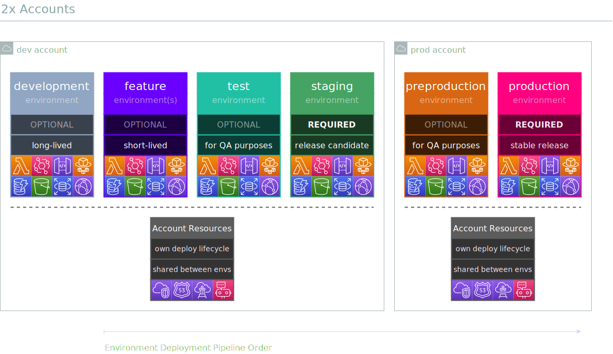
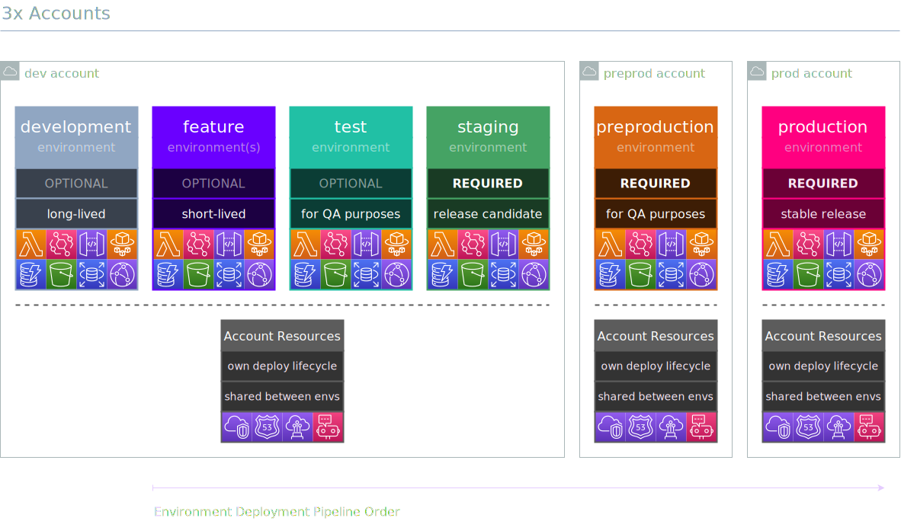

<div align="center">
	<br/>
	<br/>
  <h1>
	
  <br/>
  <br/>
  </h1>

  ```sh
  npm i -D @alma-cdk/project
  ```

  <div align="left">

  Opinionated CDK “framework” with constructs & utilities for:
  - deploying multiple environments to multiple accounts (with many-to-many relationship)
  - managing account configuration through standardized props (no more random config files)
  - querying account and/or environment specific information within your CDK code
  - enabling dynamic & short-lived “feature-environments”
  - enabling well-defined tagging
  - providing structure & common conventions to CDK projects
  - choosing the target account & environment by passing in runtime context:

    ```sh
    npx cdk deploy -c account=dev -c environment=feature/abc-123
    ```
    ... which means you don't need to define all the possibile environments ahead of time!

  </div>
  <br/>
</div>


## Account Strategies

Depending on the use case, you may choose a configuration between 1-3 AWS accounts with the following environments:


1. **Shared account (`shared`)**:

    
    <br/>

2. **Multi-account (`dev`+`prod`)**_– RECOMMENDED_:

    
    <br/>

<br/>
</details>

3. **Multi-account (`dev`+`preprod`+`prod`)**:

    
    <br/>

<br/>

## Getting Started

Steps required to define a _environmental_ project resources; At first, it might seem complex but once you get into the habbit of defining your projects this way it starts to make sense:

1. Choose your [Account Strategy](#account-strategies)

2. Initialize a new `Project` instead of `cdk.App`:

    ```ts
    // bin/app.ts
    import { Project, AccountStrategy } from '@alma-cdk/project';

    const project = new Project({
      // Basic info, you could also read these from package.json if you want
      name: 'my-cool-project',
      author: {
        organization: 'Acme Corp',
        name: 'Mad Scientists',
        email: 'mad.scientists@acme.example.com',
      },

      // If not set, defaults to one of: $CDK_DEFAULT_REGION, $AWS_REGION or us-east-1
      defaultRegion: 'eu-west-1',

      // Configures the project to use 2 AWS accounts (recommended)
      accounts: AccountStrategy.two({
        dev: {
          id: '111111111111',
          config: {
            // whatever you want here as [string]: any
            baseDomain: 'example.net',
          },
        },
        prod: {
          id: '222222222222',
          config: {
            // whatever you want here as [string]: any
            baseDomain: 'example.com',
          },
        },
      }),
    })
    ```

3. Define a stack which `extends SmartStack` with resources:
    ```ts
    // lib/my-stack.ts
    import { Construct } from 'constructs';
    import { StackProps, RemovalPolicy } from 'aws-cdk-lib';
    import { SmartStack, Name, UrlName, PathName, EC } from '@alma-cdk/project';

    export class MyStack extends SmartStack {
      constructor(scope: Construct, id: string, props?: StackProps) {
        super(scope, id, props);

        new dynamodb.Table(this, 'Table', {
          removalPolicy: EC.isStable(this) ? RemovalPolicy.RETAIN : RemovalPolicy.DESTROY,

          tableName: Name.it(this, 'MyTable'),
          partitionKey: {
            type: dynamodb.AttributeType.STRING,
            name: 'pk',
          },
          // StagingMyTable
        });

        new events.EventBus(this, 'EventBus', {
          eventBusName: Name.withProject(this, 'MyEventBus'),
          // MyCoolProjectStagingMyEventBus
        });

        new s3.Bucket(this, 'Bucket', {

          removalPolicy: EC.isStable(this) ? RemovalPolicy.RETAIN : RemovalPolicy.DESTROY,
          autoDeleteObjects: EC.isStable(this) ? false : true,

          bucketName: UrlName.globally(this, 'MyBucket'),
          // acme-corp-my-cool-project-feature-foo-bar-my-bucket
        });

        new ssm.StringParameter(this, 'Parameter', {
          stringValue: 'Foo',
          tier: ssm.ParameterTier.ADVANCED,
          parameterName: PathName.withProject(this, 'MyNamespace/MyParameter'),
          // /MyCoolProject/Staging/MyNamespace/MyParameter
        });
      }
    }
    ```

4. Define a new _environmental_ which `extends EnvironmentWrapper` and initialize all your environmental `SmartStack` stacks within:

    ```ts
    // lib/environment.ts
    import { Construct } from 'constructs';
    import { EnvironmentWrapper } from '@alma-cdk/project';
    import { MyStack } from './my-stack';

    export class Environment extends EnvironmentWrapper {
      constructor(scope: Construct) {
        super(scope);
        new MyStack(this, 'MyStack', { description: 'This is required' });
      }
    }
    ```

    Resulting Stack properties (given `environment=staging`):

    |        Property         |                    Example value                     |
    | :---------------------- | :--------------------------------------------------- |
    | `stackName`             | `"MyCoolProject-Environment-Staging-MyExampleStack"` |
    | `terminationProtection` | `true`                                               |
    | `env.account`           | `"111111111111"`                                     |
    | `env.region`            | `"eu-west-1"`                                        |

    Resulting Tags for the Stack and its resources (given `environment=staging`):

    |        Property         |           Example value           |
    | :---------------------- | :-------------------------------- |
    | `Account`               | `dev`                             |
    | `Environment`           | `staging`                         |
    | `Project`               | `my-cool-project`                 |
    | `Author`                | `Mad Scientists`                  |
    | `Organization`          | `Acme Corp`                       |
    | `Contact`               | `mad.scientists@acme.example.com` |

5. Finally initialize the environment with the `Project` scope:

    ```ts
    // bin/app.ts
    import { Project, Accounts } from '@alma-cdk/project';
    import { Environment } from '../lib/environment';

    const project = new Project({/* removed for brevity, see step 1 */})

    new Environment(project);
    ```

<br/>


## Documentation

See detailed documentation for specific classes & methods at [constructs.dev](http://constructs.dev/packages/@alma-cdk/project).

Generally speaking you would be most interested in the following:
- Project
- AccountStrategy
- SmartStack
- AccountWrapper & EnvironmentWrapper
- AccountContext (AC)
- EnvironmentContext (EC)
- Name / UrlName / PathName

# API Reference <a name="API Reference" id="api-reference"></a>

## Constructs <a name="Constructs" id="Constructs"></a>

### AccountWrapper <a name="AccountWrapper" id="@alma-cdk/project.AccountWrapper"></a>

Wrapper for account-level stacks.

#### Initializers <a name="Initializers" id="@alma-cdk/project.AccountWrapper.Initializer"></a>

```typescript
import { AccountWrapper } from '@alma-cdk/project'

new AccountWrapper(scope: Construct)
```

| **Name** | **Type** | **Description** |
| --- | --- | --- |
| <code><a href="#@alma-cdk/project.AccountWrapper.Initializer.parameter.scope">scope</a></code> | <code>constructs.Construct</code> | *No description.* |

---

##### `scope`<sup>Required</sup> <a name="scope" id="@alma-cdk/project.AccountWrapper.Initializer.parameter.scope"></a>

- *Type:* constructs.Construct

---

#### Methods <a name="Methods" id="Methods"></a>

| **Name** | **Description** |
| --- | --- |
| <code><a href="#@alma-cdk/project.AccountWrapper.toString">toString</a></code> | Returns a string representation of this construct. |

---

##### `toString` <a name="toString" id="@alma-cdk/project.AccountWrapper.toString"></a>

```typescript
public toString(): string
```

Returns a string representation of this construct.

#### Static Functions <a name="Static Functions" id="Static Functions"></a>

| **Name** | **Description** |
| --- | --- |
| <code><a href="#@alma-cdk/project.AccountWrapper.isConstruct">isConstruct</a></code> | Checks if `x` is a construct. |

---

##### `isConstruct` <a name="isConstruct" id="@alma-cdk/project.AccountWrapper.isConstruct"></a>

```typescript
import { AccountWrapper } from '@alma-cdk/project'

AccountWrapper.isConstruct(x: any)
```

Checks if `x` is a construct.

Use this method instead of `instanceof` to properly detect `Construct`
instances, even when the construct library is symlinked.

Explanation: in JavaScript, multiple copies of the `constructs` library on
disk are seen as independent, completely different libraries. As a
consequence, the class `Construct` in each copy of the `constructs` library
is seen as a different class, and an instance of one class will not test as
`instanceof` the other class. `npm install` will not create installations
like this, but users may manually symlink construct libraries together or
use a monorepo tool: in those cases, multiple copies of the `constructs`
library can be accidentally installed, and `instanceof` will behave
unpredictably. It is safest to avoid using `instanceof`, and using
this type-testing method instead.

###### `x`<sup>Required</sup> <a name="x" id="@alma-cdk/project.AccountWrapper.isConstruct.parameter.x"></a>

- *Type:* any

Any object.

---

#### Properties <a name="Properties" id="Properties"></a>

| **Name** | **Type** | **Description** |
| --- | --- | --- |
| <code><a href="#@alma-cdk/project.AccountWrapper.property.node">node</a></code> | <code>constructs.Node</code> | The tree node. |

---

##### `node`<sup>Required</sup> <a name="node" id="@alma-cdk/project.AccountWrapper.property.node"></a>

```typescript
public readonly node: Node;
```

- *Type:* constructs.Node

The tree node.

---


### EnvironmentWrapper <a name="EnvironmentWrapper" id="@alma-cdk/project.EnvironmentWrapper"></a>

Wrapper for environmental stacks.

#### Initializers <a name="Initializers" id="@alma-cdk/project.EnvironmentWrapper.Initializer"></a>

```typescript
import { EnvironmentWrapper } from '@alma-cdk/project'

new EnvironmentWrapper(scope: Construct)
```

| **Name** | **Type** | **Description** |
| --- | --- | --- |
| <code><a href="#@alma-cdk/project.EnvironmentWrapper.Initializer.parameter.scope">scope</a></code> | <code>constructs.Construct</code> | *No description.* |

---

##### `scope`<sup>Required</sup> <a name="scope" id="@alma-cdk/project.EnvironmentWrapper.Initializer.parameter.scope"></a>

- *Type:* constructs.Construct

---

#### Methods <a name="Methods" id="Methods"></a>

| **Name** | **Description** |
| --- | --- |
| <code><a href="#@alma-cdk/project.EnvironmentWrapper.toString">toString</a></code> | Returns a string representation of this construct. |

---

##### `toString` <a name="toString" id="@alma-cdk/project.EnvironmentWrapper.toString"></a>

```typescript
public toString(): string
```

Returns a string representation of this construct.

#### Static Functions <a name="Static Functions" id="Static Functions"></a>

| **Name** | **Description** |
| --- | --- |
| <code><a href="#@alma-cdk/project.EnvironmentWrapper.isConstruct">isConstruct</a></code> | Checks if `x` is a construct. |

---

##### `isConstruct` <a name="isConstruct" id="@alma-cdk/project.EnvironmentWrapper.isConstruct"></a>

```typescript
import { EnvironmentWrapper } from '@alma-cdk/project'

EnvironmentWrapper.isConstruct(x: any)
```

Checks if `x` is a construct.

Use this method instead of `instanceof` to properly detect `Construct`
instances, even when the construct library is symlinked.

Explanation: in JavaScript, multiple copies of the `constructs` library on
disk are seen as independent, completely different libraries. As a
consequence, the class `Construct` in each copy of the `constructs` library
is seen as a different class, and an instance of one class will not test as
`instanceof` the other class. `npm install` will not create installations
like this, but users may manually symlink construct libraries together or
use a monorepo tool: in those cases, multiple copies of the `constructs`
library can be accidentally installed, and `instanceof` will behave
unpredictably. It is safest to avoid using `instanceof`, and using
this type-testing method instead.

###### `x`<sup>Required</sup> <a name="x" id="@alma-cdk/project.EnvironmentWrapper.isConstruct.parameter.x"></a>

- *Type:* any

Any object.

---

#### Properties <a name="Properties" id="Properties"></a>

| **Name** | **Type** | **Description** |
| --- | --- | --- |
| <code><a href="#@alma-cdk/project.EnvironmentWrapper.property.node">node</a></code> | <code>constructs.Node</code> | The tree node. |

---

##### `node`<sup>Required</sup> <a name="node" id="@alma-cdk/project.EnvironmentWrapper.property.node"></a>

```typescript
public readonly node: Node;
```

- *Type:* constructs.Node

The tree node.

---


### Project <a name="Project" id="@alma-cdk/project.Project"></a>

High-level wrapper for `cdk.App` with specific requirements for props.

Use it like you would `cdk.App` and assign stacks into it.

*Example*

```typescript
// new Project instead of new App
const project = new Project({
  name: 'my-cool-project',
  author: {
    organization: 'Acme Corp',
    name: 'Mad Scientists',
    email: 'mad.scientists@acme.example.com',
},
defaultRegion: 'eu-west-1', // defaults to one of: $CDK_DEFAULT_REGION, $AWS_REGION or us-east-1
accounts: {
dev: {
 id: '111111111111',
 environments: ['development', 'feature/.*', 'staging'],
 config: {
   baseDomain: 'example.net',
 },
},
prod: {
 id: '222222222222',
 environments: ['production'],
 config: {
   baseDomain: 'example.com',
 },
},
},
})
```


#### Initializers <a name="Initializers" id="@alma-cdk/project.Project.Initializer"></a>

```typescript
import { Project } from '@alma-cdk/project'

new Project(props: ProjectProps)
```

| **Name** | **Type** | **Description** |
| --- | --- | --- |
| <code><a href="#@alma-cdk/project.Project.Initializer.parameter.props">props</a></code> | <code><a href="#@alma-cdk/project.ProjectProps">ProjectProps</a></code> | *No description.* |

---

##### `props`<sup>Required</sup> <a name="props" id="@alma-cdk/project.Project.Initializer.parameter.props"></a>

- *Type:* <a href="#@alma-cdk/project.ProjectProps">ProjectProps</a>

---

#### Methods <a name="Methods" id="Methods"></a>

| **Name** | **Description** |
| --- | --- |
| <code><a href="#@alma-cdk/project.Project.toString">toString</a></code> | Returns a string representation of this construct. |
| <code><a href="#@alma-cdk/project.Project.synth">synth</a></code> | Synthesize this stage into a cloud assembly. |

---

##### `toString` <a name="toString" id="@alma-cdk/project.Project.toString"></a>

```typescript
public toString(): string
```

Returns a string representation of this construct.

##### `synth` <a name="synth" id="@alma-cdk/project.Project.synth"></a>

```typescript
public synth(options?: StageSynthesisOptions): CloudAssembly
```

Synthesize this stage into a cloud assembly.

Once an assembly has been synthesized, it cannot be modified. Subsequent
calls will return the same assembly.

###### `options`<sup>Optional</sup> <a name="options" id="@alma-cdk/project.Project.synth.parameter.options"></a>

- *Type:* aws-cdk-lib.StageSynthesisOptions

---

#### Static Functions <a name="Static Functions" id="Static Functions"></a>

| **Name** | **Description** |
| --- | --- |
| <code><a href="#@alma-cdk/project.Project.isConstruct">isConstruct</a></code> | Checks if `x` is a construct. |
| <code><a href="#@alma-cdk/project.Project.isStage">isStage</a></code> | Test whether the given construct is a stage. |
| <code><a href="#@alma-cdk/project.Project.of">of</a></code> | Return the stage this construct is contained with, if available. |
| <code><a href="#@alma-cdk/project.Project.isApp">isApp</a></code> | Checks if an object is an instance of the `App` class. |
| <code><a href="#@alma-cdk/project.Project.getAccount">getAccount</a></code> | Return account configuration. |
| <code><a href="#@alma-cdk/project.Project.getConfiguration">getConfiguration</a></code> | Return the project configuration as given in ProjectProps. |

---

##### `isConstruct` <a name="isConstruct" id="@alma-cdk/project.Project.isConstruct"></a>

```typescript
import { Project } from '@alma-cdk/project'

Project.isConstruct(x: any)
```

Checks if `x` is a construct.

Use this method instead of `instanceof` to properly detect `Construct`
instances, even when the construct library is symlinked.

Explanation: in JavaScript, multiple copies of the `constructs` library on
disk are seen as independent, completely different libraries. As a
consequence, the class `Construct` in each copy of the `constructs` library
is seen as a different class, and an instance of one class will not test as
`instanceof` the other class. `npm install` will not create installations
like this, but users may manually symlink construct libraries together or
use a monorepo tool: in those cases, multiple copies of the `constructs`
library can be accidentally installed, and `instanceof` will behave
unpredictably. It is safest to avoid using `instanceof`, and using
this type-testing method instead.

###### `x`<sup>Required</sup> <a name="x" id="@alma-cdk/project.Project.isConstruct.parameter.x"></a>

- *Type:* any

Any object.

---

##### `isStage` <a name="isStage" id="@alma-cdk/project.Project.isStage"></a>

```typescript
import { Project } from '@alma-cdk/project'

Project.isStage(x: any)
```

Test whether the given construct is a stage.

###### `x`<sup>Required</sup> <a name="x" id="@alma-cdk/project.Project.isStage.parameter.x"></a>

- *Type:* any

---

##### `of` <a name="of" id="@alma-cdk/project.Project.of"></a>

```typescript
import { Project } from '@alma-cdk/project'

Project.of(construct: IConstruct)
```

Return the stage this construct is contained with, if available.

If called
on a nested stage, returns its parent.

###### `construct`<sup>Required</sup> <a name="construct" id="@alma-cdk/project.Project.of.parameter.construct"></a>

- *Type:* constructs.IConstruct

---

##### `isApp` <a name="isApp" id="@alma-cdk/project.Project.isApp"></a>

```typescript
import { Project } from '@alma-cdk/project'

Project.isApp(obj: any)
```

Checks if an object is an instance of the `App` class.

###### `obj`<sup>Required</sup> <a name="obj" id="@alma-cdk/project.Project.isApp.parameter.obj"></a>

- *Type:* any

The object to evaluate.

---

##### `getAccount` <a name="getAccount" id="@alma-cdk/project.Project.getAccount"></a>

```typescript
import { Project } from '@alma-cdk/project'

Project.getAccount(scope: Construct, accountType: string)
```

Return account configuration.

###### `scope`<sup>Required</sup> <a name="scope" id="@alma-cdk/project.Project.getAccount.parameter.scope"></a>

- *Type:* constructs.Construct

---

###### `accountType`<sup>Required</sup> <a name="accountType" id="@alma-cdk/project.Project.getAccount.parameter.accountType"></a>

- *Type:* string

---

##### `getConfiguration` <a name="getConfiguration" id="@alma-cdk/project.Project.getConfiguration"></a>

```typescript
import { Project } from '@alma-cdk/project'

Project.getConfiguration(scope: Construct)
```

Return the project configuration as given in ProjectProps.

###### `scope`<sup>Required</sup> <a name="scope" id="@alma-cdk/project.Project.getConfiguration.parameter.scope"></a>

- *Type:* constructs.Construct

---

#### Properties <a name="Properties" id="Properties"></a>

| **Name** | **Type** | **Description** |
| --- | --- | --- |
| <code><a href="#@alma-cdk/project.Project.property.node">node</a></code> | <code>constructs.Node</code> | The tree node. |
| <code><a href="#@alma-cdk/project.Project.property.artifactId">artifactId</a></code> | <code>string</code> | Artifact ID of the assembly if it is a nested stage. The root stage (app) will return an empty string. |
| <code><a href="#@alma-cdk/project.Project.property.assetOutdir">assetOutdir</a></code> | <code>string</code> | The cloud assembly asset output directory. |
| <code><a href="#@alma-cdk/project.Project.property.outdir">outdir</a></code> | <code>string</code> | The cloud assembly output directory. |
| <code><a href="#@alma-cdk/project.Project.property.policyValidationBeta1">policyValidationBeta1</a></code> | <code>aws-cdk-lib.IPolicyValidationPluginBeta1[]</code> | Validation plugins to run during synthesis. |
| <code><a href="#@alma-cdk/project.Project.property.stageName">stageName</a></code> | <code>string</code> | The name of the stage. |
| <code><a href="#@alma-cdk/project.Project.property.account">account</a></code> | <code>string</code> | The default account for all resources defined within this stage. |
| <code><a href="#@alma-cdk/project.Project.property.parentStage">parentStage</a></code> | <code>aws-cdk-lib.Stage</code> | The parent stage or `undefined` if this is the app. |
| <code><a href="#@alma-cdk/project.Project.property.region">region</a></code> | <code>string</code> | The default region for all resources defined within this stage. |

---

##### `node`<sup>Required</sup> <a name="node" id="@alma-cdk/project.Project.property.node"></a>

```typescript
public readonly node: Node;
```

- *Type:* constructs.Node

The tree node.

---

##### `artifactId`<sup>Required</sup> <a name="artifactId" id="@alma-cdk/project.Project.property.artifactId"></a>

```typescript
public readonly artifactId: string;
```

- *Type:* string

Artifact ID of the assembly if it is a nested stage. The root stage (app) will return an empty string.

Derived from the construct path.

---

##### `assetOutdir`<sup>Required</sup> <a name="assetOutdir" id="@alma-cdk/project.Project.property.assetOutdir"></a>

```typescript
public readonly assetOutdir: string;
```

- *Type:* string

The cloud assembly asset output directory.

---

##### `outdir`<sup>Required</sup> <a name="outdir" id="@alma-cdk/project.Project.property.outdir"></a>

```typescript
public readonly outdir: string;
```

- *Type:* string

The cloud assembly output directory.

---

##### `policyValidationBeta1`<sup>Required</sup> <a name="policyValidationBeta1" id="@alma-cdk/project.Project.property.policyValidationBeta1"></a>

```typescript
public readonly policyValidationBeta1: IPolicyValidationPluginBeta1[];
```

- *Type:* aws-cdk-lib.IPolicyValidationPluginBeta1[]
- *Default:* no validation plugins are used

Validation plugins to run during synthesis.

If any plugin reports any violation,
synthesis will be interrupted and the report displayed to the user.

---

##### `stageName`<sup>Required</sup> <a name="stageName" id="@alma-cdk/project.Project.property.stageName"></a>

```typescript
public readonly stageName: string;
```

- *Type:* string

The name of the stage.

Based on names of the parent stages separated by
hypens.

---

##### `account`<sup>Optional</sup> <a name="account" id="@alma-cdk/project.Project.property.account"></a>

```typescript
public readonly account: string;
```

- *Type:* string

The default account for all resources defined within this stage.

---

##### `parentStage`<sup>Optional</sup> <a name="parentStage" id="@alma-cdk/project.Project.property.parentStage"></a>

```typescript
public readonly parentStage: Stage;
```

- *Type:* aws-cdk-lib.Stage

The parent stage or `undefined` if this is the app.

*

---

##### `region`<sup>Optional</sup> <a name="region" id="@alma-cdk/project.Project.property.region"></a>

```typescript
public readonly region: string;
```

- *Type:* string

The default region for all resources defined within this stage.

---

#### Constants <a name="Constants" id="Constants"></a>

| **Name** | **Type** | **Description** |
| --- | --- | --- |
| <code><a href="#@alma-cdk/project.Project.property.CONTEXT_SCOPE">CONTEXT_SCOPE</a></code> | <code>string</code> | Namespace/key how this tool internally keeps track of the project configuration. |

---

##### `CONTEXT_SCOPE`<sup>Required</sup> <a name="CONTEXT_SCOPE" id="@alma-cdk/project.Project.property.CONTEXT_SCOPE"></a>

```typescript
public readonly CONTEXT_SCOPE: string;
```

- *Type:* string

Namespace/key how this tool internally keeps track of the project configuration.

---

### SmartStack <a name="SmartStack" id="@alma-cdk/project.SmartStack"></a>

#### Initializers <a name="Initializers" id="@alma-cdk/project.SmartStack.Initializer"></a>

```typescript
import { SmartStack } from '@alma-cdk/project'

new SmartStack(scope: Construct, id: string, props: StackProps)
```

| **Name** | **Type** | **Description** |
| --- | --- | --- |
| <code><a href="#@alma-cdk/project.SmartStack.Initializer.parameter.scope">scope</a></code> | <code>constructs.Construct</code> | *No description.* |
| <code><a href="#@alma-cdk/project.SmartStack.Initializer.parameter.id">id</a></code> | <code>string</code> | *No description.* |
| <code><a href="#@alma-cdk/project.SmartStack.Initializer.parameter.props">props</a></code> | <code>aws-cdk-lib.StackProps</code> | *No description.* |

---

##### `scope`<sup>Required</sup> <a name="scope" id="@alma-cdk/project.SmartStack.Initializer.parameter.scope"></a>

- *Type:* constructs.Construct

---

##### `id`<sup>Required</sup> <a name="id" id="@alma-cdk/project.SmartStack.Initializer.parameter.id"></a>

- *Type:* string

---

##### `props`<sup>Required</sup> <a name="props" id="@alma-cdk/project.SmartStack.Initializer.parameter.props"></a>

- *Type:* aws-cdk-lib.StackProps

---

#### Methods <a name="Methods" id="Methods"></a>

| **Name** | **Description** |
| --- | --- |
| <code><a href="#@alma-cdk/project.SmartStack.toString">toString</a></code> | Returns a string representation of this construct. |
| <code><a href="#@alma-cdk/project.SmartStack.addDependency">addDependency</a></code> | Add a dependency between this stack and another stack. |
| <code><a href="#@alma-cdk/project.SmartStack.addMetadata">addMetadata</a></code> | Adds an arbitary key-value pair, with information you want to record about the stack. |
| <code><a href="#@alma-cdk/project.SmartStack.addTransform">addTransform</a></code> | Add a Transform to this stack. A Transform is a macro that AWS CloudFormation uses to process your template. |
| <code><a href="#@alma-cdk/project.SmartStack.exportStringListValue">exportStringListValue</a></code> | Create a CloudFormation Export for a string list value. |
| <code><a href="#@alma-cdk/project.SmartStack.exportValue">exportValue</a></code> | Create a CloudFormation Export for a string value. |
| <code><a href="#@alma-cdk/project.SmartStack.formatArn">formatArn</a></code> | Creates an ARN from components. |
| <code><a href="#@alma-cdk/project.SmartStack.getLogicalId">getLogicalId</a></code> | Allocates a stack-unique CloudFormation-compatible logical identity for a specific resource. |
| <code><a href="#@alma-cdk/project.SmartStack.regionalFact">regionalFact</a></code> | Look up a fact value for the given fact for the region of this stack. |
| <code><a href="#@alma-cdk/project.SmartStack.renameLogicalId">renameLogicalId</a></code> | Rename a generated logical identities. |
| <code><a href="#@alma-cdk/project.SmartStack.reportMissingContextKey">reportMissingContextKey</a></code> | Indicate that a context key was expected. |
| <code><a href="#@alma-cdk/project.SmartStack.resolve">resolve</a></code> | Resolve a tokenized value in the context of the current stack. |
| <code><a href="#@alma-cdk/project.SmartStack.splitArn">splitArn</a></code> | Splits the provided ARN into its components. |
| <code><a href="#@alma-cdk/project.SmartStack.toJsonString">toJsonString</a></code> | Convert an object, potentially containing tokens, to a JSON string. |
| <code><a href="#@alma-cdk/project.SmartStack.toYamlString">toYamlString</a></code> | Convert an object, potentially containing tokens, to a YAML string. |

---

##### `toString` <a name="toString" id="@alma-cdk/project.SmartStack.toString"></a>

```typescript
public toString(): string
```

Returns a string representation of this construct.

##### `addDependency` <a name="addDependency" id="@alma-cdk/project.SmartStack.addDependency"></a>

```typescript
public addDependency(target: Stack, reason?: string): void
```

Add a dependency between this stack and another stack.

This can be used to define dependencies between any two stacks within an
app, and also supports nested stacks.

###### `target`<sup>Required</sup> <a name="target" id="@alma-cdk/project.SmartStack.addDependency.parameter.target"></a>

- *Type:* aws-cdk-lib.Stack

---

###### `reason`<sup>Optional</sup> <a name="reason" id="@alma-cdk/project.SmartStack.addDependency.parameter.reason"></a>

- *Type:* string

---

##### `addMetadata` <a name="addMetadata" id="@alma-cdk/project.SmartStack.addMetadata"></a>

```typescript
public addMetadata(key: string, value: any): void
```

Adds an arbitary key-value pair, with information you want to record about the stack.

These get translated to the Metadata section of the generated template.

> [https://docs.aws.amazon.com/AWSCloudFormation/latest/UserGuide/metadata-section-structure.html](https://docs.aws.amazon.com/AWSCloudFormation/latest/UserGuide/metadata-section-structure.html)

###### `key`<sup>Required</sup> <a name="key" id="@alma-cdk/project.SmartStack.addMetadata.parameter.key"></a>

- *Type:* string

---

###### `value`<sup>Required</sup> <a name="value" id="@alma-cdk/project.SmartStack.addMetadata.parameter.value"></a>

- *Type:* any

---

##### `addTransform` <a name="addTransform" id="@alma-cdk/project.SmartStack.addTransform"></a>

```typescript
public addTransform(transform: string): void
```

Add a Transform to this stack. A Transform is a macro that AWS CloudFormation uses to process your template.

Duplicate values are removed when stack is synthesized.

> [https://docs.aws.amazon.com/AWSCloudFormation/latest/UserGuide/transform-section-structure.html](https://docs.aws.amazon.com/AWSCloudFormation/latest/UserGuide/transform-section-structure.html)

*Example*

```typescript
declare const stack: Stack;

stack.addTransform('AWS::Serverless-2016-10-31')
```


###### `transform`<sup>Required</sup> <a name="transform" id="@alma-cdk/project.SmartStack.addTransform.parameter.transform"></a>

- *Type:* string

The transform to add.

---

##### `exportStringListValue` <a name="exportStringListValue" id="@alma-cdk/project.SmartStack.exportStringListValue"></a>

```typescript
public exportStringListValue(exportedValue: any, options?: ExportValueOptions): string[]
```

Create a CloudFormation Export for a string list value.

Returns a string list representing the corresponding `Fn.importValue()`
expression for this Export. The export expression is automatically wrapped with an
`Fn::Join` and the import value with an `Fn::Split`, since CloudFormation can only
export strings. You can control the name for the export by passing the `name` option.

If you don't supply a value for `name`, the value you're exporting must be
a Resource attribute (for example: `bucket.bucketName`) and it will be
given the same name as the automatic cross-stack reference that would be created
if you used the attribute in another Stack.

One of the uses for this method is to *remove* the relationship between
two Stacks established by automatic cross-stack references. It will
temporarily ensure that the CloudFormation Export still exists while you
remove the reference from the consuming stack. After that, you can remove
the resource and the manual export.

See `exportValue` for an example of this process.

###### `exportedValue`<sup>Required</sup> <a name="exportedValue" id="@alma-cdk/project.SmartStack.exportStringListValue.parameter.exportedValue"></a>

- *Type:* any

---

###### `options`<sup>Optional</sup> <a name="options" id="@alma-cdk/project.SmartStack.exportStringListValue.parameter.options"></a>

- *Type:* aws-cdk-lib.ExportValueOptions

---

##### `exportValue` <a name="exportValue" id="@alma-cdk/project.SmartStack.exportValue"></a>

```typescript
public exportValue(exportedValue: any, options?: ExportValueOptions): string
```

Create a CloudFormation Export for a string value.

Returns a string representing the corresponding `Fn.importValue()`
expression for this Export. You can control the name for the export by
passing the `name` option.

If you don't supply a value for `name`, the value you're exporting must be
a Resource attribute (for example: `bucket.bucketName`) and it will be
given the same name as the automatic cross-stack reference that would be created
if you used the attribute in another Stack.

One of the uses for this method is to *remove* the relationship between
two Stacks established by automatic cross-stack references. It will
temporarily ensure that the CloudFormation Export still exists while you
remove the reference from the consuming stack. After that, you can remove
the resource and the manual export.

## Example

Here is how the process works. Let's say there are two stacks,
`producerStack` and `consumerStack`, and `producerStack` has a bucket
called `bucket`, which is referenced by `consumerStack` (perhaps because
an AWS Lambda Function writes into it, or something like that).

It is not safe to remove `producerStack.bucket` because as the bucket is being
deleted, `consumerStack` might still be using it.

Instead, the process takes two deployments:

### Deployment 1: break the relationship

- Make sure `consumerStack` no longer references `bucket.bucketName` (maybe the consumer
  stack now uses its own bucket, or it writes to an AWS DynamoDB table, or maybe you just
  remove the Lambda Function altogether).
- In the `ProducerStack` class, call `this.exportValue(this.bucket.bucketName)`. This
  will make sure the CloudFormation Export continues to exist while the relationship
  between the two stacks is being broken.
- Deploy (this will effectively only change the `consumerStack`, but it's safe to deploy both).

### Deployment 2: remove the bucket resource

- You are now free to remove the `bucket` resource from `producerStack`.
- Don't forget to remove the `exportValue()` call as well.
- Deploy again (this time only the `producerStack` will be changed -- the bucket will be deleted).

###### `exportedValue`<sup>Required</sup> <a name="exportedValue" id="@alma-cdk/project.SmartStack.exportValue.parameter.exportedValue"></a>

- *Type:* any

---

###### `options`<sup>Optional</sup> <a name="options" id="@alma-cdk/project.SmartStack.exportValue.parameter.options"></a>

- *Type:* aws-cdk-lib.ExportValueOptions

---

##### `formatArn` <a name="formatArn" id="@alma-cdk/project.SmartStack.formatArn"></a>

```typescript
public formatArn(components: ArnComponents): string
```

Creates an ARN from components.

If `partition`, `region` or `account` are not specified, the stack's
partition, region and account will be used.

If any component is the empty string, an empty string will be inserted
into the generated ARN at the location that component corresponds to.

The ARN will be formatted as follows:

  arn:{partition}:{service}:{region}:{account}:{resource}{sep}{resource-name}

The required ARN pieces that are omitted will be taken from the stack that
the 'scope' is attached to. If all ARN pieces are supplied, the supplied scope
can be 'undefined'.

###### `components`<sup>Required</sup> <a name="components" id="@alma-cdk/project.SmartStack.formatArn.parameter.components"></a>

- *Type:* aws-cdk-lib.ArnComponents

---

##### `getLogicalId` <a name="getLogicalId" id="@alma-cdk/project.SmartStack.getLogicalId"></a>

```typescript
public getLogicalId(element: CfnElement): string
```

Allocates a stack-unique CloudFormation-compatible logical identity for a specific resource.

This method is called when a `CfnElement` is created and used to render the
initial logical identity of resources. Logical ID renames are applied at
this stage.

This method uses the protected method `allocateLogicalId` to render the
logical ID for an element. To modify the naming scheme, extend the `Stack`
class and override this method.

###### `element`<sup>Required</sup> <a name="element" id="@alma-cdk/project.SmartStack.getLogicalId.parameter.element"></a>

- *Type:* aws-cdk-lib.CfnElement

The CloudFormation element for which a logical identity is needed.

---

##### `regionalFact` <a name="regionalFact" id="@alma-cdk/project.SmartStack.regionalFact"></a>

```typescript
public regionalFact(factName: string, defaultValue?: string): string
```

Look up a fact value for the given fact for the region of this stack.

Will return a definite value only if the region of the current stack is resolved.
If not, a lookup map will be added to the stack and the lookup will be done at
CDK deployment time.

What regions will be included in the lookup map is controlled by the
`@aws-cdk/core:target-partitions` context value: it must be set to a list
of partitions, and only regions from the given partitions will be included.
If no such context key is set, all regions will be included.

This function is intended to be used by construct library authors. Application
builders can rely on the abstractions offered by construct libraries and do
not have to worry about regional facts.

If `defaultValue` is not given, it is an error if the fact is unknown for
the given region.

###### `factName`<sup>Required</sup> <a name="factName" id="@alma-cdk/project.SmartStack.regionalFact.parameter.factName"></a>

- *Type:* string

---

###### `defaultValue`<sup>Optional</sup> <a name="defaultValue" id="@alma-cdk/project.SmartStack.regionalFact.parameter.defaultValue"></a>

- *Type:* string

---

##### `renameLogicalId` <a name="renameLogicalId" id="@alma-cdk/project.SmartStack.renameLogicalId"></a>

```typescript
public renameLogicalId(oldId: string, newId: string): void
```

Rename a generated logical identities.

To modify the naming scheme strategy, extend the `Stack` class and
override the `allocateLogicalId` method.

###### `oldId`<sup>Required</sup> <a name="oldId" id="@alma-cdk/project.SmartStack.renameLogicalId.parameter.oldId"></a>

- *Type:* string

---

###### `newId`<sup>Required</sup> <a name="newId" id="@alma-cdk/project.SmartStack.renameLogicalId.parameter.newId"></a>

- *Type:* string

---

##### `reportMissingContextKey` <a name="reportMissingContextKey" id="@alma-cdk/project.SmartStack.reportMissingContextKey"></a>

```typescript
public reportMissingContextKey(report: MissingContext): void
```

Indicate that a context key was expected.

Contains instructions which will be emitted into the cloud assembly on how
the key should be supplied.

###### `report`<sup>Required</sup> <a name="report" id="@alma-cdk/project.SmartStack.reportMissingContextKey.parameter.report"></a>

- *Type:* aws-cdk-lib.cloud_assembly_schema.MissingContext

The set of parameters needed to obtain the context.

---

##### `resolve` <a name="resolve" id="@alma-cdk/project.SmartStack.resolve"></a>

```typescript
public resolve(obj: any): any
```

Resolve a tokenized value in the context of the current stack.

###### `obj`<sup>Required</sup> <a name="obj" id="@alma-cdk/project.SmartStack.resolve.parameter.obj"></a>

- *Type:* any

---

##### `splitArn` <a name="splitArn" id="@alma-cdk/project.SmartStack.splitArn"></a>

```typescript
public splitArn(arn: string, arnFormat: ArnFormat): ArnComponents
```

Splits the provided ARN into its components.

Works both if 'arn' is a string like 'arn:aws:s3:::bucket',
and a Token representing a dynamic CloudFormation expression
(in which case the returned components will also be dynamic CloudFormation expressions,
encoded as Tokens).

###### `arn`<sup>Required</sup> <a name="arn" id="@alma-cdk/project.SmartStack.splitArn.parameter.arn"></a>

- *Type:* string

the ARN to split into its components.

---

###### `arnFormat`<sup>Required</sup> <a name="arnFormat" id="@alma-cdk/project.SmartStack.splitArn.parameter.arnFormat"></a>

- *Type:* aws-cdk-lib.ArnFormat

the expected format of 'arn' - depends on what format the service 'arn' represents uses.

---

##### `toJsonString` <a name="toJsonString" id="@alma-cdk/project.SmartStack.toJsonString"></a>

```typescript
public toJsonString(obj: any, space?: number): string
```

Convert an object, potentially containing tokens, to a JSON string.

###### `obj`<sup>Required</sup> <a name="obj" id="@alma-cdk/project.SmartStack.toJsonString.parameter.obj"></a>

- *Type:* any

---

###### `space`<sup>Optional</sup> <a name="space" id="@alma-cdk/project.SmartStack.toJsonString.parameter.space"></a>

- *Type:* number

---

##### `toYamlString` <a name="toYamlString" id="@alma-cdk/project.SmartStack.toYamlString"></a>

```typescript
public toYamlString(obj: any): string
```

Convert an object, potentially containing tokens, to a YAML string.

###### `obj`<sup>Required</sup> <a name="obj" id="@alma-cdk/project.SmartStack.toYamlString.parameter.obj"></a>

- *Type:* any

---

#### Static Functions <a name="Static Functions" id="Static Functions"></a>

| **Name** | **Description** |
| --- | --- |
| <code><a href="#@alma-cdk/project.SmartStack.isConstruct">isConstruct</a></code> | Checks if `x` is a construct. |
| <code><a href="#@alma-cdk/project.SmartStack.isStack">isStack</a></code> | Return whether the given object is a Stack. |
| <code><a href="#@alma-cdk/project.SmartStack.of">of</a></code> | Looks up the first stack scope in which `construct` is defined. |

---

##### `isConstruct` <a name="isConstruct" id="@alma-cdk/project.SmartStack.isConstruct"></a>

```typescript
import { SmartStack } from '@alma-cdk/project'

SmartStack.isConstruct(x: any)
```

Checks if `x` is a construct.

Use this method instead of `instanceof` to properly detect `Construct`
instances, even when the construct library is symlinked.

Explanation: in JavaScript, multiple copies of the `constructs` library on
disk are seen as independent, completely different libraries. As a
consequence, the class `Construct` in each copy of the `constructs` library
is seen as a different class, and an instance of one class will not test as
`instanceof` the other class. `npm install` will not create installations
like this, but users may manually symlink construct libraries together or
use a monorepo tool: in those cases, multiple copies of the `constructs`
library can be accidentally installed, and `instanceof` will behave
unpredictably. It is safest to avoid using `instanceof`, and using
this type-testing method instead.

###### `x`<sup>Required</sup> <a name="x" id="@alma-cdk/project.SmartStack.isConstruct.parameter.x"></a>

- *Type:* any

Any object.

---

##### `isStack` <a name="isStack" id="@alma-cdk/project.SmartStack.isStack"></a>

```typescript
import { SmartStack } from '@alma-cdk/project'

SmartStack.isStack(x: any)
```

Return whether the given object is a Stack.

We do attribute detection since we can't reliably use 'instanceof'.

###### `x`<sup>Required</sup> <a name="x" id="@alma-cdk/project.SmartStack.isStack.parameter.x"></a>

- *Type:* any

---

##### `of` <a name="of" id="@alma-cdk/project.SmartStack.of"></a>

```typescript
import { SmartStack } from '@alma-cdk/project'

SmartStack.of(construct: IConstruct)
```

Looks up the first stack scope in which `construct` is defined.

Fails if there is no stack up the tree.

###### `construct`<sup>Required</sup> <a name="construct" id="@alma-cdk/project.SmartStack.of.parameter.construct"></a>

- *Type:* constructs.IConstruct

The construct to start the search from.

---

#### Properties <a name="Properties" id="Properties"></a>

| **Name** | **Type** | **Description** |
| --- | --- | --- |
| <code><a href="#@alma-cdk/project.SmartStack.property.node">node</a></code> | <code>constructs.Node</code> | The tree node. |
| <code><a href="#@alma-cdk/project.SmartStack.property.account">account</a></code> | <code>string</code> | The AWS account into which this stack will be deployed. |
| <code><a href="#@alma-cdk/project.SmartStack.property.artifactId">artifactId</a></code> | <code>string</code> | The ID of the cloud assembly artifact for this stack. |
| <code><a href="#@alma-cdk/project.SmartStack.property.availabilityZones">availabilityZones</a></code> | <code>string[]</code> | Returns the list of AZs that are available in the AWS environment (account/region) associated with this stack. |
| <code><a href="#@alma-cdk/project.SmartStack.property.bundlingRequired">bundlingRequired</a></code> | <code>boolean</code> | Indicates whether the stack requires bundling or not. |
| <code><a href="#@alma-cdk/project.SmartStack.property.dependencies">dependencies</a></code> | <code>aws-cdk-lib.Stack[]</code> | Return the stacks this stack depends on. |
| <code><a href="#@alma-cdk/project.SmartStack.property.environment">environment</a></code> | <code>string</code> | The environment coordinates in which this stack is deployed. |
| <code><a href="#@alma-cdk/project.SmartStack.property.nested">nested</a></code> | <code>boolean</code> | Indicates if this is a nested stack, in which case `parentStack` will include a reference to it's parent. |
| <code><a href="#@alma-cdk/project.SmartStack.property.notificationArns">notificationArns</a></code> | <code>string[]</code> | Returns the list of notification Amazon Resource Names (ARNs) for the current stack. |
| <code><a href="#@alma-cdk/project.SmartStack.property.partition">partition</a></code> | <code>string</code> | The partition in which this stack is defined. |
| <code><a href="#@alma-cdk/project.SmartStack.property.region">region</a></code> | <code>string</code> | The AWS region into which this stack will be deployed (e.g. `us-west-2`). |
| <code><a href="#@alma-cdk/project.SmartStack.property.stackId">stackId</a></code> | <code>string</code> | The ID of the stack. |
| <code><a href="#@alma-cdk/project.SmartStack.property.stackName">stackName</a></code> | <code>string</code> | The concrete CloudFormation physical stack name. |
| <code><a href="#@alma-cdk/project.SmartStack.property.synthesizer">synthesizer</a></code> | <code>aws-cdk-lib.IStackSynthesizer</code> | Synthesis method for this stack. |
| <code><a href="#@alma-cdk/project.SmartStack.property.tags">tags</a></code> | <code>aws-cdk-lib.TagManager</code> | Tags to be applied to the stack. |
| <code><a href="#@alma-cdk/project.SmartStack.property.templateFile">templateFile</a></code> | <code>string</code> | The name of the CloudFormation template file emitted to the output directory during synthesis. |
| <code><a href="#@alma-cdk/project.SmartStack.property.templateOptions">templateOptions</a></code> | <code>aws-cdk-lib.ITemplateOptions</code> | Options for CloudFormation template (like version, transform, description). |
| <code><a href="#@alma-cdk/project.SmartStack.property.urlSuffix">urlSuffix</a></code> | <code>string</code> | The Amazon domain suffix for the region in which this stack is defined. |
| <code><a href="#@alma-cdk/project.SmartStack.property.nestedStackParent">nestedStackParent</a></code> | <code>aws-cdk-lib.Stack</code> | If this is a nested stack, returns it's parent stack. |
| <code><a href="#@alma-cdk/project.SmartStack.property.nestedStackResource">nestedStackResource</a></code> | <code>aws-cdk-lib.CfnResource</code> | If this is a nested stack, this represents its `AWS::CloudFormation::Stack` resource. |
| <code><a href="#@alma-cdk/project.SmartStack.property.terminationProtection">terminationProtection</a></code> | <code>boolean</code> | Whether termination protection is enabled for this stack. |

---

##### `node`<sup>Required</sup> <a name="node" id="@alma-cdk/project.SmartStack.property.node"></a>

```typescript
public readonly node: Node;
```

- *Type:* constructs.Node

The tree node.

---

##### `account`<sup>Required</sup> <a name="account" id="@alma-cdk/project.SmartStack.property.account"></a>

```typescript
public readonly account: string;
```

- *Type:* string

The AWS account into which this stack will be deployed.

This value is resolved according to the following rules:

1. The value provided to `env.account` when the stack is defined. This can
   either be a concrete account (e.g. `585695031111`) or the
   `Aws.ACCOUNT_ID` token.
3. `Aws.ACCOUNT_ID`, which represents the CloudFormation intrinsic reference
   `{ "Ref": "AWS::AccountId" }` encoded as a string token.

Preferably, you should use the return value as an opaque string and not
attempt to parse it to implement your logic. If you do, you must first
check that it is a concrete value an not an unresolved token. If this
value is an unresolved token (`Token.isUnresolved(stack.account)` returns
`true`), this implies that the user wishes that this stack will synthesize
into a **account-agnostic template**. In this case, your code should either
fail (throw an error, emit a synth error using `Annotations.of(construct).addError()`) or
implement some other region-agnostic behavior.

---

##### `artifactId`<sup>Required</sup> <a name="artifactId" id="@alma-cdk/project.SmartStack.property.artifactId"></a>

```typescript
public readonly artifactId: string;
```

- *Type:* string

The ID of the cloud assembly artifact for this stack.

---

##### `availabilityZones`<sup>Required</sup> <a name="availabilityZones" id="@alma-cdk/project.SmartStack.property.availabilityZones"></a>

```typescript
public readonly availabilityZones: string[];
```

- *Type:* string[]

Returns the list of AZs that are available in the AWS environment (account/region) associated with this stack.

If the stack is environment-agnostic (either account and/or region are
tokens), this property will return an array with 2 tokens that will resolve
at deploy-time to the first two availability zones returned from CloudFormation's
`Fn::GetAZs` intrinsic function.

If they are not available in the context, returns a set of dummy values and
reports them as missing, and let the CLI resolve them by calling EC2
`DescribeAvailabilityZones` on the target environment.

To specify a different strategy for selecting availability zones override this method.

---

##### `bundlingRequired`<sup>Required</sup> <a name="bundlingRequired" id="@alma-cdk/project.SmartStack.property.bundlingRequired"></a>

```typescript
public readonly bundlingRequired: boolean;
```

- *Type:* boolean

Indicates whether the stack requires bundling or not.

---

##### `dependencies`<sup>Required</sup> <a name="dependencies" id="@alma-cdk/project.SmartStack.property.dependencies"></a>

```typescript
public readonly dependencies: Stack[];
```

- *Type:* aws-cdk-lib.Stack[]

Return the stacks this stack depends on.

---

##### `environment`<sup>Required</sup> <a name="environment" id="@alma-cdk/project.SmartStack.property.environment"></a>

```typescript
public readonly environment: string;
```

- *Type:* string

The environment coordinates in which this stack is deployed.

In the form
`aws://account/region`. Use `stack.account` and `stack.region` to obtain
the specific values, no need to parse.

You can use this value to determine if two stacks are targeting the same
environment.

If either `stack.account` or `stack.region` are not concrete values (e.g.
`Aws.ACCOUNT_ID` or `Aws.REGION`) the special strings `unknown-account` and/or
`unknown-region` will be used respectively to indicate this stack is
region/account-agnostic.

---

##### `nested`<sup>Required</sup> <a name="nested" id="@alma-cdk/project.SmartStack.property.nested"></a>

```typescript
public readonly nested: boolean;
```

- *Type:* boolean

Indicates if this is a nested stack, in which case `parentStack` will include a reference to it's parent.

---

##### `notificationArns`<sup>Required</sup> <a name="notificationArns" id="@alma-cdk/project.SmartStack.property.notificationArns"></a>

```typescript
public readonly notificationArns: string[];
```

- *Type:* string[]

Returns the list of notification Amazon Resource Names (ARNs) for the current stack.

---

##### `partition`<sup>Required</sup> <a name="partition" id="@alma-cdk/project.SmartStack.property.partition"></a>

```typescript
public readonly partition: string;
```

- *Type:* string

The partition in which this stack is defined.

---

##### `region`<sup>Required</sup> <a name="region" id="@alma-cdk/project.SmartStack.property.region"></a>

```typescript
public readonly region: string;
```

- *Type:* string

The AWS region into which this stack will be deployed (e.g. `us-west-2`).

This value is resolved according to the following rules:

1. The value provided to `env.region` when the stack is defined. This can
   either be a concrete region (e.g. `us-west-2`) or the `Aws.REGION`
   token.
3. `Aws.REGION`, which is represents the CloudFormation intrinsic reference
   `{ "Ref": "AWS::Region" }` encoded as a string token.

Preferably, you should use the return value as an opaque string and not
attempt to parse it to implement your logic. If you do, you must first
check that it is a concrete value an not an unresolved token. If this
value is an unresolved token (`Token.isUnresolved(stack.region)` returns
`true`), this implies that the user wishes that this stack will synthesize
into a **region-agnostic template**. In this case, your code should either
fail (throw an error, emit a synth error using `Annotations.of(construct).addError()`) or
implement some other region-agnostic behavior.

---

##### `stackId`<sup>Required</sup> <a name="stackId" id="@alma-cdk/project.SmartStack.property.stackId"></a>

```typescript
public readonly stackId: string;
```

- *Type:* string

The ID of the stack.

---

*Example*

```typescript
// After resolving, looks like
'arn:aws:cloudformation:us-west-2:123456789012:stack/teststack/51af3dc0-da77-11e4-872e-1234567db123'
```


##### `stackName`<sup>Required</sup> <a name="stackName" id="@alma-cdk/project.SmartStack.property.stackName"></a>

```typescript
public readonly stackName: string;
```

- *Type:* string

The concrete CloudFormation physical stack name.

This is either the name defined explicitly in the `stackName` prop or
allocated based on the stack's location in the construct tree. Stacks that
are directly defined under the app use their construct `id` as their stack
name. Stacks that are defined deeper within the tree will use a hashed naming
scheme based on the construct path to ensure uniqueness.

If you wish to obtain the deploy-time AWS::StackName intrinsic,
you can use `Aws.STACK_NAME` directly.

---

##### `synthesizer`<sup>Required</sup> <a name="synthesizer" id="@alma-cdk/project.SmartStack.property.synthesizer"></a>

```typescript
public readonly synthesizer: IStackSynthesizer;
```

- *Type:* aws-cdk-lib.IStackSynthesizer

Synthesis method for this stack.

---

##### `tags`<sup>Required</sup> <a name="tags" id="@alma-cdk/project.SmartStack.property.tags"></a>

```typescript
public readonly tags: TagManager;
```

- *Type:* aws-cdk-lib.TagManager

Tags to be applied to the stack.

---

##### `templateFile`<sup>Required</sup> <a name="templateFile" id="@alma-cdk/project.SmartStack.property.templateFile"></a>

```typescript
public readonly templateFile: string;
```

- *Type:* string

The name of the CloudFormation template file emitted to the output directory during synthesis.

Example value: `MyStack.template.json`

---

##### `templateOptions`<sup>Required</sup> <a name="templateOptions" id="@alma-cdk/project.SmartStack.property.templateOptions"></a>

```typescript
public readonly templateOptions: ITemplateOptions;
```

- *Type:* aws-cdk-lib.ITemplateOptions

Options for CloudFormation template (like version, transform, description).

---

##### `urlSuffix`<sup>Required</sup> <a name="urlSuffix" id="@alma-cdk/project.SmartStack.property.urlSuffix"></a>

```typescript
public readonly urlSuffix: string;
```

- *Type:* string

The Amazon domain suffix for the region in which this stack is defined.

---

##### `nestedStackParent`<sup>Optional</sup> <a name="nestedStackParent" id="@alma-cdk/project.SmartStack.property.nestedStackParent"></a>

```typescript
public readonly nestedStackParent: Stack;
```

- *Type:* aws-cdk-lib.Stack

If this is a nested stack, returns it's parent stack.

---

##### `nestedStackResource`<sup>Optional</sup> <a name="nestedStackResource" id="@alma-cdk/project.SmartStack.property.nestedStackResource"></a>

```typescript
public readonly nestedStackResource: CfnResource;
```

- *Type:* aws-cdk-lib.CfnResource

If this is a nested stack, this represents its `AWS::CloudFormation::Stack` resource.

`undefined` for top-level (non-nested) stacks.

---

##### `terminationProtection`<sup>Required</sup> <a name="terminationProtection" id="@alma-cdk/project.SmartStack.property.terminationProtection"></a>

```typescript
public readonly terminationProtection: boolean;
```

- *Type:* boolean

Whether termination protection is enabled for this stack.

---


## Structs <a name="Structs" id="Structs"></a>

### Account <a name="Account" id="@alma-cdk/project.Account"></a>

AWS account configuration.

#### Initializer <a name="Initializer" id="@alma-cdk/project.Account.Initializer"></a>

```typescript
import { Account } from '@alma-cdk/project'

const account: Account = { ... }
```

#### Properties <a name="Properties" id="Properties"></a>

| **Name** | **Type** | **Description** |
| --- | --- | --- |
| <code><a href="#@alma-cdk/project.Account.property.id">id</a></code> | <code>string</code> | AWS Account ID. |
| <code><a href="#@alma-cdk/project.Account.property.config">config</a></code> | <code>{[ key: string ]: any}</code> | AWS account specific configuration. |
| <code><a href="#@alma-cdk/project.Account.property.environments">environments</a></code> | <code>string[]</code> | List of accepted environments for the given account. |

---

##### `id`<sup>Required</sup> <a name="id" id="@alma-cdk/project.Account.property.id"></a>

```typescript
public readonly id: string;
```

- *Type:* string

AWS Account ID.

---

*Example*

```typescript
'123456789012'
```


##### `config`<sup>Optional</sup> <a name="config" id="@alma-cdk/project.Account.property.config"></a>

```typescript
public readonly config: {[ key: string ]: any};
```

- *Type:* {[ key: string ]: any}

AWS account specific configuration.

For example VPC IDs (for existing VPCs), Direct Connect Gateway IDs, apex domain names (for Route53 Zone lookups), etc. Basically configuration for resources that are defined outside of this CDK application.

---

*Example*

```typescript
{
  dev: {
    id: '111111111111',
    config: {
      baseDomain: 'example.net',
    },
  },
  prod: {
    id: '222222222222',
    config: {
      baseDomain: 'example.com',
    },
  },
},
```


##### `environments`<sup>Optional</sup> <a name="environments" id="@alma-cdk/project.Account.property.environments"></a>

```typescript
public readonly environments: string[];
```

- *Type:* string[]

List of accepted environments for the given account.

List of strings or strings representing regexp initialization (passed onto `new Regexp("^"+environment+"$", "i")`).

---

*Example*

```typescript
["development", "feature/.*"]
```


### AccountConfiguration <a name="AccountConfiguration" id="@alma-cdk/project.AccountConfiguration"></a>

Interface for a single account type configuration.

#### Initializer <a name="Initializer" id="@alma-cdk/project.AccountConfiguration.Initializer"></a>

```typescript
import { AccountConfiguration } from '@alma-cdk/project'

const accountConfiguration: AccountConfiguration = { ... }
```

#### Properties <a name="Properties" id="Properties"></a>

| **Name** | **Type** | **Description** |
| --- | --- | --- |
| <code><a href="#@alma-cdk/project.AccountConfiguration.property.id">id</a></code> | <code>string</code> | *No description.* |
| <code><a href="#@alma-cdk/project.AccountConfiguration.property.config">config</a></code> | <code>{[ key: string ]: any}</code> | *No description.* |

---

##### `id`<sup>Required</sup> <a name="id" id="@alma-cdk/project.AccountConfiguration.property.id"></a>

```typescript
public readonly id: string;
```

- *Type:* string

---

##### `config`<sup>Optional</sup> <a name="config" id="@alma-cdk/project.AccountConfiguration.property.config"></a>

```typescript
public readonly config: {[ key: string ]: any};
```

- *Type:* {[ key: string ]: any}

---

### AccountStrategyOneProps <a name="AccountStrategyOneProps" id="@alma-cdk/project.AccountStrategyOneProps"></a>

Props `AccountStrategy.one`.

#### Initializer <a name="Initializer" id="@alma-cdk/project.AccountStrategyOneProps.Initializer"></a>

```typescript
import { AccountStrategyOneProps } from '@alma-cdk/project'

const accountStrategyOneProps: AccountStrategyOneProps = { ... }
```

#### Properties <a name="Properties" id="Properties"></a>

| **Name** | **Type** | **Description** |
| --- | --- | --- |
| <code><a href="#@alma-cdk/project.AccountStrategyOneProps.property.shared">shared</a></code> | <code><a href="#@alma-cdk/project.AccountConfiguration">AccountConfiguration</a></code> | *No description.* |
| <code><a href="#@alma-cdk/project.AccountStrategyOneProps.property.mock">mock</a></code> | <code><a href="#@alma-cdk/project.AccountConfiguration">AccountConfiguration</a></code> | *No description.* |

---

##### `shared`<sup>Required</sup> <a name="shared" id="@alma-cdk/project.AccountStrategyOneProps.property.shared"></a>

```typescript
public readonly shared: AccountConfiguration;
```

- *Type:* <a href="#@alma-cdk/project.AccountConfiguration">AccountConfiguration</a>

---

##### `mock`<sup>Optional</sup> <a name="mock" id="@alma-cdk/project.AccountStrategyOneProps.property.mock"></a>

```typescript
public readonly mock: AccountConfiguration;
```

- *Type:* <a href="#@alma-cdk/project.AccountConfiguration">AccountConfiguration</a>

---

### AccountStrategyThreeProps <a name="AccountStrategyThreeProps" id="@alma-cdk/project.AccountStrategyThreeProps"></a>

Props `AccountStrategy.three`.

#### Initializer <a name="Initializer" id="@alma-cdk/project.AccountStrategyThreeProps.Initializer"></a>

```typescript
import { AccountStrategyThreeProps } from '@alma-cdk/project'

const accountStrategyThreeProps: AccountStrategyThreeProps = { ... }
```

#### Properties <a name="Properties" id="Properties"></a>

| **Name** | **Type** | **Description** |
| --- | --- | --- |
| <code><a href="#@alma-cdk/project.AccountStrategyThreeProps.property.dev">dev</a></code> | <code><a href="#@alma-cdk/project.AccountConfiguration">AccountConfiguration</a></code> | *No description.* |
| <code><a href="#@alma-cdk/project.AccountStrategyThreeProps.property.preprod">preprod</a></code> | <code><a href="#@alma-cdk/project.AccountConfiguration">AccountConfiguration</a></code> | *No description.* |
| <code><a href="#@alma-cdk/project.AccountStrategyThreeProps.property.prod">prod</a></code> | <code><a href="#@alma-cdk/project.AccountConfiguration">AccountConfiguration</a></code> | *No description.* |
| <code><a href="#@alma-cdk/project.AccountStrategyThreeProps.property.mock">mock</a></code> | <code><a href="#@alma-cdk/project.AccountConfiguration">AccountConfiguration</a></code> | *No description.* |

---

##### `dev`<sup>Required</sup> <a name="dev" id="@alma-cdk/project.AccountStrategyThreeProps.property.dev"></a>

```typescript
public readonly dev: AccountConfiguration;
```

- *Type:* <a href="#@alma-cdk/project.AccountConfiguration">AccountConfiguration</a>

---

##### `preprod`<sup>Required</sup> <a name="preprod" id="@alma-cdk/project.AccountStrategyThreeProps.property.preprod"></a>

```typescript
public readonly preprod: AccountConfiguration;
```

- *Type:* <a href="#@alma-cdk/project.AccountConfiguration">AccountConfiguration</a>

---

##### `prod`<sup>Required</sup> <a name="prod" id="@alma-cdk/project.AccountStrategyThreeProps.property.prod"></a>

```typescript
public readonly prod: AccountConfiguration;
```

- *Type:* <a href="#@alma-cdk/project.AccountConfiguration">AccountConfiguration</a>

---

##### `mock`<sup>Optional</sup> <a name="mock" id="@alma-cdk/project.AccountStrategyThreeProps.property.mock"></a>

```typescript
public readonly mock: AccountConfiguration;
```

- *Type:* <a href="#@alma-cdk/project.AccountConfiguration">AccountConfiguration</a>

---

### AccountStrategyTwoProps <a name="AccountStrategyTwoProps" id="@alma-cdk/project.AccountStrategyTwoProps"></a>

Props `AccountStrategy.two`.

#### Initializer <a name="Initializer" id="@alma-cdk/project.AccountStrategyTwoProps.Initializer"></a>

```typescript
import { AccountStrategyTwoProps } from '@alma-cdk/project'

const accountStrategyTwoProps: AccountStrategyTwoProps = { ... }
```

#### Properties <a name="Properties" id="Properties"></a>

| **Name** | **Type** | **Description** |
| --- | --- | --- |
| <code><a href="#@alma-cdk/project.AccountStrategyTwoProps.property.dev">dev</a></code> | <code><a href="#@alma-cdk/project.AccountConfiguration">AccountConfiguration</a></code> | *No description.* |
| <code><a href="#@alma-cdk/project.AccountStrategyTwoProps.property.prod">prod</a></code> | <code><a href="#@alma-cdk/project.AccountConfiguration">AccountConfiguration</a></code> | *No description.* |
| <code><a href="#@alma-cdk/project.AccountStrategyTwoProps.property.mock">mock</a></code> | <code><a href="#@alma-cdk/project.AccountConfiguration">AccountConfiguration</a></code> | *No description.* |

---

##### `dev`<sup>Required</sup> <a name="dev" id="@alma-cdk/project.AccountStrategyTwoProps.property.dev"></a>

```typescript
public readonly dev: AccountConfiguration;
```

- *Type:* <a href="#@alma-cdk/project.AccountConfiguration">AccountConfiguration</a>

---

##### `prod`<sup>Required</sup> <a name="prod" id="@alma-cdk/project.AccountStrategyTwoProps.property.prod"></a>

```typescript
public readonly prod: AccountConfiguration;
```

- *Type:* <a href="#@alma-cdk/project.AccountConfiguration">AccountConfiguration</a>

---

##### `mock`<sup>Optional</sup> <a name="mock" id="@alma-cdk/project.AccountStrategyTwoProps.property.mock"></a>

```typescript
public readonly mock: AccountConfiguration;
```

- *Type:* <a href="#@alma-cdk/project.AccountConfiguration">AccountConfiguration</a>

---

### Author <a name="Author" id="@alma-cdk/project.Author"></a>

Author information.

I.e. who owns/develops this project/service.

#### Initializer <a name="Initializer" id="@alma-cdk/project.Author.Initializer"></a>

```typescript
import { Author } from '@alma-cdk/project'

const author: Author = { ... }
```

#### Properties <a name="Properties" id="Properties"></a>

| **Name** | **Type** | **Description** |
| --- | --- | --- |
| <code><a href="#@alma-cdk/project.Author.property.name">name</a></code> | <code>string</code> | Human-readable name for the team/contact responsible for this project/service. |
| <code><a href="#@alma-cdk/project.Author.property.email">email</a></code> | <code>string</code> | Email address for the team/contact responsible for this project/service. |
| <code><a href="#@alma-cdk/project.Author.property.organization">organization</a></code> | <code>string</code> | Human-readable name for the organization responsible for this project/service. |

---

##### `name`<sup>Required</sup> <a name="name" id="@alma-cdk/project.Author.property.name"></a>

```typescript
public readonly name: string;
```

- *Type:* string

Human-readable name for the team/contact responsible for this project/service.

---

*Example*

```typescript
'Mad Scientists'
```


##### `email`<sup>Optional</sup> <a name="email" id="@alma-cdk/project.Author.property.email"></a>

```typescript
public readonly email: string;
```

- *Type:* string

Email address for the team/contact responsible for this project/service.

---

*Example*

```typescript
'mad.scientists@acme.example.com'
```


##### `organization`<sup>Optional</sup> <a name="organization" id="@alma-cdk/project.Author.property.organization"></a>

```typescript
public readonly organization: string;
```

- *Type:* string

Human-readable name for the organization responsible for this project/service.

---

*Example*

```typescript
'Acme Corp'
```


### NameProps <a name="NameProps" id="@alma-cdk/project.NameProps"></a>

#### Initializer <a name="Initializer" id="@alma-cdk/project.NameProps.Initializer"></a>

```typescript
import { NameProps } from '@alma-cdk/project'

const nameProps: NameProps = { ... }
```

#### Properties <a name="Properties" id="Properties"></a>

| **Name** | **Type** | **Description** |
| --- | --- | --- |
| <code><a href="#@alma-cdk/project.NameProps.property.maxLength">maxLength</a></code> | <code>number</code> | *No description.* |
| <code><a href="#@alma-cdk/project.NameProps.property.trim">trim</a></code> | <code>boolean</code> | *No description.* |

---

##### `maxLength`<sup>Optional</sup> <a name="maxLength" id="@alma-cdk/project.NameProps.property.maxLength"></a>

```typescript
public readonly maxLength: number;
```

- *Type:* number

---

##### `trim`<sup>Optional</sup> <a name="trim" id="@alma-cdk/project.NameProps.property.trim"></a>

```typescript
public readonly trim: boolean;
```

- *Type:* boolean

---

### ProjectConfiguration <a name="ProjectConfiguration" id="@alma-cdk/project.ProjectConfiguration"></a>

#### Initializer <a name="Initializer" id="@alma-cdk/project.ProjectConfiguration.Initializer"></a>

```typescript
import { ProjectConfiguration } from '@alma-cdk/project'

const projectConfiguration: ProjectConfiguration = { ... }
```

#### Properties <a name="Properties" id="Properties"></a>

| **Name** | **Type** | **Description** |
| --- | --- | --- |
| <code><a href="#@alma-cdk/project.ProjectConfiguration.property.accounts">accounts</a></code> | <code>{[ key: string ]: <a href="#@alma-cdk/project.Account">Account</a>}</code> | Dictionary of AWS account specific configuration. |
| <code><a href="#@alma-cdk/project.ProjectConfiguration.property.author">author</a></code> | <code><a href="#@alma-cdk/project.Author">Author</a></code> | Author information. |
| <code><a href="#@alma-cdk/project.ProjectConfiguration.property.name">name</a></code> | <code>string</code> | Name of your project/service. |
| <code><a href="#@alma-cdk/project.ProjectConfiguration.property.defaultRegion">defaultRegion</a></code> | <code>string</code> | Specify default region you wish to use. |

---

##### `accounts`<sup>Required</sup> <a name="accounts" id="@alma-cdk/project.ProjectConfiguration.property.accounts"></a>

```typescript
public readonly accounts: {[ key: string ]: Account};
```

- *Type:* {[ key: string ]: <a href="#@alma-cdk/project.Account">Account</a>}

Dictionary of AWS account specific configuration.

The key value can be anything (such as AWS Account alias), but it's recommended to keep it short such as `dev` or `prod`.

---

*Example*

```typescript
accounts: {
  dev: {
    id: '111111111111',
    config: {
      baseDomain: 'example.net',
    },
  },
  prod: {
    id: '222222222222',
    config: {
      baseDomain: 'example.com',
    },
  },
},
```


##### `author`<sup>Required</sup> <a name="author" id="@alma-cdk/project.ProjectConfiguration.property.author"></a>

```typescript
public readonly author: Author;
```

- *Type:* <a href="#@alma-cdk/project.Author">Author</a>

Author information.

I.e. who owns/develops this project/service.

---

##### `name`<sup>Required</sup> <a name="name" id="@alma-cdk/project.ProjectConfiguration.property.name"></a>

```typescript
public readonly name: string;
```

- *Type:* string

Name of your project/service.

Prefer `hyphen-case`.

---

*Example*

```typescript
'my-cool-project'
```


##### `defaultRegion`<sup>Optional</sup> <a name="defaultRegion" id="@alma-cdk/project.ProjectConfiguration.property.defaultRegion"></a>

```typescript
public readonly defaultRegion: string;
```

- *Type:* string

Specify default region you wish to use.

If left empty will default to one of the following in order:
1. `$CDK_DEFAULT_REGION`
2. `$AWS_REGION`
3. 'us-east-1'

---

### ProjectProps <a name="ProjectProps" id="@alma-cdk/project.ProjectProps"></a>

Props given to `Project`.

I.e. custom props for this construct and the usual props given to `cdk.App`.

#### Initializer <a name="Initializer" id="@alma-cdk/project.ProjectProps.Initializer"></a>

```typescript
import { ProjectProps } from '@alma-cdk/project'

const projectProps: ProjectProps = { ... }
```

#### Properties <a name="Properties" id="Properties"></a>

| **Name** | **Type** | **Description** |
| --- | --- | --- |
| <code><a href="#@alma-cdk/project.ProjectProps.property.accounts">accounts</a></code> | <code>{[ key: string ]: <a href="#@alma-cdk/project.Account">Account</a>}</code> | Dictionary of AWS account specific configuration. |
| <code><a href="#@alma-cdk/project.ProjectProps.property.author">author</a></code> | <code><a href="#@alma-cdk/project.Author">Author</a></code> | Author information. |
| <code><a href="#@alma-cdk/project.ProjectProps.property.name">name</a></code> | <code>string</code> | Name of your project/service. |
| <code><a href="#@alma-cdk/project.ProjectProps.property.defaultRegion">defaultRegion</a></code> | <code>string</code> | Specify default region you wish to use. |
| <code><a href="#@alma-cdk/project.ProjectProps.property.analyticsReporting">analyticsReporting</a></code> | <code>boolean</code> | Include runtime versioning information in the Stacks of this app. |
| <code><a href="#@alma-cdk/project.ProjectProps.property.autoSynth">autoSynth</a></code> | <code>boolean</code> | Automatically call `synth()` before the program exits. |
| <code><a href="#@alma-cdk/project.ProjectProps.property.context">context</a></code> | <code>{[ key: string ]: any}</code> | Additional context values for the application. |
| <code><a href="#@alma-cdk/project.ProjectProps.property.defaultStackSynthesizer">defaultStackSynthesizer</a></code> | <code>aws-cdk-lib.IReusableStackSynthesizer</code> | The stack synthesizer to use by default for all Stacks in the App. |
| <code><a href="#@alma-cdk/project.ProjectProps.property.outdir">outdir</a></code> | <code>string</code> | The output directory into which to emit synthesized artifacts. |
| <code><a href="#@alma-cdk/project.ProjectProps.property.policyValidationBeta1">policyValidationBeta1</a></code> | <code>aws-cdk-lib.IPolicyValidationPluginBeta1[]</code> | Validation plugins to run after synthesis. |
| <code><a href="#@alma-cdk/project.ProjectProps.property.postCliContext">postCliContext</a></code> | <code>{[ key: string ]: any}</code> | Additional context values for the application. |
| <code><a href="#@alma-cdk/project.ProjectProps.property.stackTraces">stackTraces</a></code> | <code>boolean</code> | Include construct creation stack trace in the `aws:cdk:trace` metadata key of all constructs. |
| <code><a href="#@alma-cdk/project.ProjectProps.property.treeMetadata">treeMetadata</a></code> | <code>boolean</code> | Include construct tree metadata as part of the Cloud Assembly. |

---

##### `accounts`<sup>Required</sup> <a name="accounts" id="@alma-cdk/project.ProjectProps.property.accounts"></a>

```typescript
public readonly accounts: {[ key: string ]: Account};
```

- *Type:* {[ key: string ]: <a href="#@alma-cdk/project.Account">Account</a>}

Dictionary of AWS account specific configuration.

The key value can be anything (such as AWS Account alias), but it's recommended to keep it short such as `dev` or `prod`.

---

*Example*

```typescript
accounts: {
  dev: {
    id: '111111111111',
    config: {
      baseDomain: 'example.net',
    },
  },
  prod: {
    id: '222222222222',
    config: {
      baseDomain: 'example.com',
    },
  },
},
```


##### `author`<sup>Required</sup> <a name="author" id="@alma-cdk/project.ProjectProps.property.author"></a>

```typescript
public readonly author: Author;
```

- *Type:* <a href="#@alma-cdk/project.Author">Author</a>

Author information.

I.e. who owns/develops this project/service.

---

##### `name`<sup>Required</sup> <a name="name" id="@alma-cdk/project.ProjectProps.property.name"></a>

```typescript
public readonly name: string;
```

- *Type:* string

Name of your project/service.

Prefer `hyphen-case`.

---

*Example*

```typescript
'my-cool-project'
```


##### `defaultRegion`<sup>Optional</sup> <a name="defaultRegion" id="@alma-cdk/project.ProjectProps.property.defaultRegion"></a>

```typescript
public readonly defaultRegion: string;
```

- *Type:* string

Specify default region you wish to use.

If left empty will default to one of the following in order:
1. `$CDK_DEFAULT_REGION`
2. `$AWS_REGION`
3. 'us-east-1'

---

##### `analyticsReporting`<sup>Optional</sup> <a name="analyticsReporting" id="@alma-cdk/project.ProjectProps.property.analyticsReporting"></a>

```typescript
public readonly analyticsReporting: boolean;
```

- *Type:* boolean
- *Default:* Value of 'aws:cdk:version-reporting' context key

Include runtime versioning information in the Stacks of this app.

---

##### `autoSynth`<sup>Optional</sup> <a name="autoSynth" id="@alma-cdk/project.ProjectProps.property.autoSynth"></a>

```typescript
public readonly autoSynth: boolean;
```

- *Type:* boolean
- *Default:* true if running via CDK CLI (`CDK_OUTDIR` is set), `false` otherwise

Automatically call `synth()` before the program exits.

If you set this, you don't have to call `synth()` explicitly. Note that
this feature is only available for certain programming languages, and
calling `synth()` is still recommended.

---

##### `context`<sup>Optional</sup> <a name="context" id="@alma-cdk/project.ProjectProps.property.context"></a>

```typescript
public readonly context: {[ key: string ]: any};
```

- *Type:* {[ key: string ]: any}
- *Default:* no additional context

Additional context values for the application.

Context set by the CLI or the `context` key in `cdk.json` has precedence.

Context can be read from any construct using `node.getContext(key)`.

---

##### `defaultStackSynthesizer`<sup>Optional</sup> <a name="defaultStackSynthesizer" id="@alma-cdk/project.ProjectProps.property.defaultStackSynthesizer"></a>

```typescript
public readonly defaultStackSynthesizer: IReusableStackSynthesizer;
```

- *Type:* aws-cdk-lib.IReusableStackSynthesizer
- *Default:* A `DefaultStackSynthesizer` with default settings

The stack synthesizer to use by default for all Stacks in the App.

The Stack Synthesizer controls aspects of synthesis and deployment,
like how assets are referenced and what IAM roles to use. For more
information, see the README of the main CDK package.

---

##### `outdir`<sup>Optional</sup> <a name="outdir" id="@alma-cdk/project.ProjectProps.property.outdir"></a>

```typescript
public readonly outdir: string;
```

- *Type:* string
- *Default:* If this value is _not_ set, considers the environment variable `CDK_OUTDIR`.   If `CDK_OUTDIR` is not defined, uses a temp directory.

The output directory into which to emit synthesized artifacts.

You should never need to set this value. By default, the value you pass to
the CLI's `--output` flag will be used, and if you change it to a different
directory the CLI will fail to pick up the generated Cloud Assembly.

This property is intended for internal and testing use.

---

##### `policyValidationBeta1`<sup>Optional</sup> <a name="policyValidationBeta1" id="@alma-cdk/project.ProjectProps.property.policyValidationBeta1"></a>

```typescript
public readonly policyValidationBeta1: IPolicyValidationPluginBeta1[];
```

- *Type:* aws-cdk-lib.IPolicyValidationPluginBeta1[]
- *Default:* no validation plugins

Validation plugins to run after synthesis.

---

##### `postCliContext`<sup>Optional</sup> <a name="postCliContext" id="@alma-cdk/project.ProjectProps.property.postCliContext"></a>

```typescript
public readonly postCliContext: {[ key: string ]: any};
```

- *Type:* {[ key: string ]: any}
- *Default:* no additional context

Additional context values for the application.

Context provided here has precedence over context set by:

- The CLI via --context
- The `context` key in `cdk.json`
- The `AppProps.context` property

This property is recommended over the `AppProps.context` property since you
can make final decision over which context value to take in your app.

Context can be read from any construct using `node.getContext(key)`.

---

*Example*

```typescript
// context from the CLI and from `cdk.json` are stored in the
// CDK_CONTEXT env variable
const cliContext = JSON.parse(process.env.CDK_CONTEXT!);

// determine whether to take the context passed in the CLI or not
const determineValue = process.env.PROD ? cliContext.SOMEKEY : 'my-prod-value';
new App({
  postCliContext: {
    SOMEKEY: determineValue,
  },
});
```


##### `stackTraces`<sup>Optional</sup> <a name="stackTraces" id="@alma-cdk/project.ProjectProps.property.stackTraces"></a>

```typescript
public readonly stackTraces: boolean;
```

- *Type:* boolean
- *Default:* true stack traces are included unless `aws:cdk:disable-stack-trace` is set in the context.

Include construct creation stack trace in the `aws:cdk:trace` metadata key of all constructs.

---

##### `treeMetadata`<sup>Optional</sup> <a name="treeMetadata" id="@alma-cdk/project.ProjectProps.property.treeMetadata"></a>

```typescript
public readonly treeMetadata: boolean;
```

- *Type:* boolean
- *Default:* true

Include construct tree metadata as part of the Cloud Assembly.

---

## Classes <a name="Classes" id="Classes"></a>

### AccountContext <a name="AccountContext" id="@alma-cdk/project.AccountContext"></a>

#### Initializers <a name="Initializers" id="@alma-cdk/project.AccountContext.Initializer"></a>

```typescript
import { AccountContext } from '@alma-cdk/project'

new AccountContext()
```

| **Name** | **Type** | **Description** |
| --- | --- | --- |

---


#### Static Functions <a name="Static Functions" id="Static Functions"></a>

| **Name** | **Description** |
| --- | --- |
| <code><a href="#@alma-cdk/project.AccountContext.getAccountConfig">getAccountConfig</a></code> | *No description.* |
| <code><a href="#@alma-cdk/project.AccountContext.getAccountId">getAccountId</a></code> | *No description.* |
| <code><a href="#@alma-cdk/project.AccountContext.getAccountType">getAccountType</a></code> | *No description.* |
| <code><a href="#@alma-cdk/project.AccountContext.isDev">isDev</a></code> | *No description.* |
| <code><a href="#@alma-cdk/project.AccountContext.isMock">isMock</a></code> | *No description.* |
| <code><a href="#@alma-cdk/project.AccountContext.isPreProd">isPreProd</a></code> | *No description.* |
| <code><a href="#@alma-cdk/project.AccountContext.isProd">isProd</a></code> | *No description.* |
| <code><a href="#@alma-cdk/project.AccountContext.isShared">isShared</a></code> | *No description.* |

---

##### `getAccountConfig` <a name="getAccountConfig" id="@alma-cdk/project.AccountContext.getAccountConfig"></a>

```typescript
import { AccountContext } from '@alma-cdk/project'

AccountContext.getAccountConfig(scope: Construct, key: string)
```

###### `scope`<sup>Required</sup> <a name="scope" id="@alma-cdk/project.AccountContext.getAccountConfig.parameter.scope"></a>

- *Type:* constructs.Construct

---

###### `key`<sup>Required</sup> <a name="key" id="@alma-cdk/project.AccountContext.getAccountConfig.parameter.key"></a>

- *Type:* string

---

##### `getAccountId` <a name="getAccountId" id="@alma-cdk/project.AccountContext.getAccountId"></a>

```typescript
import { AccountContext } from '@alma-cdk/project'

AccountContext.getAccountId(scope: Construct)
```

###### `scope`<sup>Required</sup> <a name="scope" id="@alma-cdk/project.AccountContext.getAccountId.parameter.scope"></a>

- *Type:* constructs.Construct

---

##### `getAccountType` <a name="getAccountType" id="@alma-cdk/project.AccountContext.getAccountType"></a>

```typescript
import { AccountContext } from '@alma-cdk/project'

AccountContext.getAccountType(scope: Construct)
```

###### `scope`<sup>Required</sup> <a name="scope" id="@alma-cdk/project.AccountContext.getAccountType.parameter.scope"></a>

- *Type:* constructs.Construct

---

##### `isDev` <a name="isDev" id="@alma-cdk/project.AccountContext.isDev"></a>

```typescript
import { AccountContext } from '@alma-cdk/project'

AccountContext.isDev(scope: Construct)
```

###### `scope`<sup>Required</sup> <a name="scope" id="@alma-cdk/project.AccountContext.isDev.parameter.scope"></a>

- *Type:* constructs.Construct

---

##### `isMock` <a name="isMock" id="@alma-cdk/project.AccountContext.isMock"></a>

```typescript
import { AccountContext } from '@alma-cdk/project'

AccountContext.isMock(scope: Construct)
```

###### `scope`<sup>Required</sup> <a name="scope" id="@alma-cdk/project.AccountContext.isMock.parameter.scope"></a>

- *Type:* constructs.Construct

---

##### `isPreProd` <a name="isPreProd" id="@alma-cdk/project.AccountContext.isPreProd"></a>

```typescript
import { AccountContext } from '@alma-cdk/project'

AccountContext.isPreProd(scope: Construct)
```

###### `scope`<sup>Required</sup> <a name="scope" id="@alma-cdk/project.AccountContext.isPreProd.parameter.scope"></a>

- *Type:* constructs.Construct

---

##### `isProd` <a name="isProd" id="@alma-cdk/project.AccountContext.isProd"></a>

```typescript
import { AccountContext } from '@alma-cdk/project'

AccountContext.isProd(scope: Construct)
```

###### `scope`<sup>Required</sup> <a name="scope" id="@alma-cdk/project.AccountContext.isProd.parameter.scope"></a>

- *Type:* constructs.Construct

---

##### `isShared` <a name="isShared" id="@alma-cdk/project.AccountContext.isShared"></a>

```typescript
import { AccountContext } from '@alma-cdk/project'

AccountContext.isShared(scope: Construct)
```

###### `scope`<sup>Required</sup> <a name="scope" id="@alma-cdk/project.AccountContext.isShared.parameter.scope"></a>

- *Type:* constructs.Construct

---


### AccountStrategy <a name="AccountStrategy" id="@alma-cdk/project.AccountStrategy"></a>

Use static methods of `AccountStrategy` abstract class to define your account strategy.

Available strategies are:
- One Account: `shared`
- Two Accounts: `dev`+`prod` – _recommended_
- Three Accounts: `dev`+`preprod`+`prod`

#### Initializers <a name="Initializers" id="@alma-cdk/project.AccountStrategy.Initializer"></a>

```typescript
import { AccountStrategy } from '@alma-cdk/project'

new AccountStrategy()
```

| **Name** | **Type** | **Description** |
| --- | --- | --- |

---


#### Static Functions <a name="Static Functions" id="Static Functions"></a>

| **Name** | **Description** |
| --- | --- |
| <code><a href="#@alma-cdk/project.AccountStrategy.one">one</a></code> | Enables single account strategy. |
| <code><a href="#@alma-cdk/project.AccountStrategy.three">three</a></code> | Enables triple account strategy. |
| <code><a href="#@alma-cdk/project.AccountStrategy.two">two</a></code> | Enables dual account strategy. |

---

##### `one` <a name="one" id="@alma-cdk/project.AccountStrategy.one"></a>

```typescript
import { AccountStrategy } from '@alma-cdk/project'

AccountStrategy.one(props: AccountStrategyOneProps)
```

Enables single account strategy.

1. `shared` account with environments:
    - development
    - feature/*
    - test
    - qaN
    - staging
    - preproduction
    - production

*Example*

```typescript
AccountStrategy.one({
  shared: {
    id: '111111111111',
  },
}),
```


###### `props`<sup>Required</sup> <a name="props" id="@alma-cdk/project.AccountStrategy.one.parameter.props"></a>

- *Type:* <a href="#@alma-cdk/project.AccountStrategyOneProps">AccountStrategyOneProps</a>

---

##### `three` <a name="three" id="@alma-cdk/project.AccountStrategy.three"></a>

```typescript
import { AccountStrategy } from '@alma-cdk/project'

AccountStrategy.three(props: AccountStrategyThreeProps)
```

Enables triple account strategy.

1. `dev` account with environments:
    - development
    - feature/*
    - test
    - staging
2. `preprod` account with environments:
    - qaN
    - preproduction
3. `prod` account with environments:
    - production

*Example*

```typescript
AccountStrategy.three({
  dev: {
    id: '111111111111',
  },
  preprod: {
    id: '222222222222',
  },
  prod: {
    id: '333333333333',
  },
}),
```


###### `props`<sup>Required</sup> <a name="props" id="@alma-cdk/project.AccountStrategy.three.parameter.props"></a>

- *Type:* <a href="#@alma-cdk/project.AccountStrategyThreeProps">AccountStrategyThreeProps</a>

---

##### `two` <a name="two" id="@alma-cdk/project.AccountStrategy.two"></a>

```typescript
import { AccountStrategy } from '@alma-cdk/project'

AccountStrategy.two(props: AccountStrategyTwoProps)
```

Enables dual account strategy.

1. `dev` account with environments:
    - development
    - feature/*
    - test
    - qaN
    - staging
2. `prod` account with environments:
    - preproduction
    - production

*Example*

```typescript
AccountStrategy.two({
  dev: {
    id: '111111111111',
  },
  prod: {
    id: '222222222222',
  },
}),
```


###### `props`<sup>Required</sup> <a name="props" id="@alma-cdk/project.AccountStrategy.two.parameter.props"></a>

- *Type:* <a href="#@alma-cdk/project.AccountStrategyTwoProps">AccountStrategyTwoProps</a>

---


### AccountType <a name="AccountType" id="@alma-cdk/project.AccountType"></a>

Internal class to handle set/get operations for Account Type.

#### Initializers <a name="Initializers" id="@alma-cdk/project.AccountType.Initializer"></a>

```typescript
import { AccountType } from '@alma-cdk/project'

new AccountType()
```

| **Name** | **Type** | **Description** |
| --- | --- | --- |

---


#### Static Functions <a name="Static Functions" id="Static Functions"></a>

| **Name** | **Description** |
| --- | --- |
| <code><a href="#@alma-cdk/project.AccountType.get">get</a></code> | *No description.* |
| <code><a href="#@alma-cdk/project.AccountType.matchFromEnvironment">matchFromEnvironment</a></code> | *No description.* |
| <code><a href="#@alma-cdk/project.AccountType.set">set</a></code> | *No description.* |

---

##### `get` <a name="get" id="@alma-cdk/project.AccountType.get"></a>

```typescript
import { AccountType } from '@alma-cdk/project'

AccountType.get(scope: Construct)
```

###### `scope`<sup>Required</sup> <a name="scope" id="@alma-cdk/project.AccountType.get.parameter.scope"></a>

- *Type:* constructs.Construct

---

##### `matchFromEnvironment` <a name="matchFromEnvironment" id="@alma-cdk/project.AccountType.matchFromEnvironment"></a>

```typescript
import { AccountType } from '@alma-cdk/project'

AccountType.matchFromEnvironment(scope: Construct, accounts: {[ key: string ]: Account}, environmentType: string)
```

###### `scope`<sup>Required</sup> <a name="scope" id="@alma-cdk/project.AccountType.matchFromEnvironment.parameter.scope"></a>

- *Type:* constructs.Construct

---

###### `accounts`<sup>Required</sup> <a name="accounts" id="@alma-cdk/project.AccountType.matchFromEnvironment.parameter.accounts"></a>

- *Type:* {[ key: string ]: <a href="#@alma-cdk/project.Account">Account</a>}

---

###### `environmentType`<sup>Required</sup> <a name="environmentType" id="@alma-cdk/project.AccountType.matchFromEnvironment.parameter.environmentType"></a>

- *Type:* string

---

##### `set` <a name="set" id="@alma-cdk/project.AccountType.set"></a>

```typescript
import { AccountType } from '@alma-cdk/project'

AccountType.set(scope: Construct, accountType: string)
```

###### `scope`<sup>Required</sup> <a name="scope" id="@alma-cdk/project.AccountType.set.parameter.scope"></a>

- *Type:* constructs.Construct

---

###### `accountType`<sup>Required</sup> <a name="accountType" id="@alma-cdk/project.AccountType.set.parameter.accountType"></a>

- *Type:* string

---


### EnvironmentContext <a name="EnvironmentContext" id="@alma-cdk/project.EnvironmentContext"></a>

#### Initializers <a name="Initializers" id="@alma-cdk/project.EnvironmentContext.Initializer"></a>

```typescript
import { EnvironmentContext } from '@alma-cdk/project'

new EnvironmentContext()
```

| **Name** | **Type** | **Description** |
| --- | --- | --- |

---


#### Static Functions <a name="Static Functions" id="Static Functions"></a>

| **Name** | **Description** |
| --- | --- |
| <code><a href="#@alma-cdk/project.EnvironmentContext.getCategory">getCategory</a></code> | Get Environment Category. |
| <code><a href="#@alma-cdk/project.EnvironmentContext.getFeatureInfo">getFeatureInfo</a></code> | Get Feature Info. |
| <code><a href="#@alma-cdk/project.EnvironmentContext.getLabel">getLabel</a></code> | Get Environment Label. |
| <code><a href="#@alma-cdk/project.EnvironmentContext.getName">getName</a></code> | Get Environment Name. |
| <code><a href="#@alma-cdk/project.EnvironmentContext.getUrlName">getUrlName</a></code> | Get Environment URL/DNS Compatible Name. |
| <code><a href="#@alma-cdk/project.EnvironmentContext.isDevelopment">isDevelopment</a></code> | Check if Environment is part of `development` category. |
| <code><a href="#@alma-cdk/project.EnvironmentContext.isFeature">isFeature</a></code> | Check if Environment is part of `feature` category. |
| <code><a href="#@alma-cdk/project.EnvironmentContext.isMock">isMock</a></code> | Check if Environment is part of `mock` category. |
| <code><a href="#@alma-cdk/project.EnvironmentContext.isStable">isStable</a></code> | Check if Environment is part of `stable` category. |
| <code><a href="#@alma-cdk/project.EnvironmentContext.isVerification">isVerification</a></code> | Check if Environment is part of `verification` category. |

---

##### `getCategory` <a name="getCategory" id="@alma-cdk/project.EnvironmentContext.getCategory"></a>

```typescript
import { EnvironmentContext } from '@alma-cdk/project'

EnvironmentContext.getCategory(scope: Construct)
```

Get Environment Category.

Categories are useful grouping to make distinction between `stable`
environments (`staging` & `production`) from `feature` or `verification`
environments (such as `test` or `preproduction`).

*Example*

```typescript
'mock'
'development'
'feature'
'verification'
'stable'
```


###### `scope`<sup>Required</sup> <a name="scope" id="@alma-cdk/project.EnvironmentContext.getCategory.parameter.scope"></a>

- *Type:* constructs.Construct

Construct.

---

##### `getFeatureInfo` <a name="getFeatureInfo" id="@alma-cdk/project.EnvironmentContext.getFeatureInfo"></a>

```typescript
import { EnvironmentContext } from '@alma-cdk/project'

EnvironmentContext.getFeatureInfo(scope: Construct)
```

Get Feature Info.

If environment belongs to `feature` category,
this will return a string describing the feature (sting after `feature/`-prefix).

If environment is not a feature environment, will return an empty string.

###### `scope`<sup>Required</sup> <a name="scope" id="@alma-cdk/project.EnvironmentContext.getFeatureInfo.parameter.scope"></a>

- *Type:* constructs.Construct

Construct.

---

##### `getLabel` <a name="getLabel" id="@alma-cdk/project.EnvironmentContext.getLabel"></a>

```typescript
import { EnvironmentContext } from '@alma-cdk/project'

EnvironmentContext.getLabel(scope: Construct)
```

Get Environment Label.

Labels are useful since Environment Name can be complex,
such as `feature/foo-bar` or `qa3`,
but we need to be able to “label” all `feature/*` and `qaN` environments
as either `feature` or `qa`.

*Example*

```typescript
'mock'
'development'
'feature'
'test'
'staging'
'qa'
'preproduction'
'production'
```


###### `scope`<sup>Required</sup> <a name="scope" id="@alma-cdk/project.EnvironmentContext.getLabel.parameter.scope"></a>

- *Type:* constructs.Construct

Construct.

---

##### `getName` <a name="getName" id="@alma-cdk/project.EnvironmentContext.getName"></a>

```typescript
import { EnvironmentContext } from '@alma-cdk/project'

EnvironmentContext.getName(scope: Construct)
```

Get Environment Name.

*Example*

```typescript
'mock1'
'mock2'
'mock3'
'development'
'feature/foo-bar'
'feature/ABC-123/new-stuff'
'test'
'staging'
'qa1'
'qa2'
'qa3'
'preproduction'
'production'
```


###### `scope`<sup>Required</sup> <a name="scope" id="@alma-cdk/project.EnvironmentContext.getName.parameter.scope"></a>

- *Type:* constructs.Construct

Construct.

---

##### `getUrlName` <a name="getUrlName" id="@alma-cdk/project.EnvironmentContext.getUrlName"></a>

```typescript
import { EnvironmentContext } from '@alma-cdk/project'

EnvironmentContext.getUrlName(scope: Construct)
```

Get Environment URL/DNS Compatible Name.

*Example*

```typescript
'mock1'
'mock2'
'mock3'
'development'
'feature-foo-bar'
'feature-abc-123-new-stuff'
'test'
'staging'
'qa1'
'qa2'
'qa3'
'preproduction'
'production'
```


###### `scope`<sup>Required</sup> <a name="scope" id="@alma-cdk/project.EnvironmentContext.getUrlName.parameter.scope"></a>

- *Type:* constructs.Construct

Construct.

---

##### `isDevelopment` <a name="isDevelopment" id="@alma-cdk/project.EnvironmentContext.isDevelopment"></a>

```typescript
import { EnvironmentContext } from '@alma-cdk/project'

EnvironmentContext.isDevelopment(scope: Construct)
```

Check if Environment is part of `development` category.

Returns true for `development`, otherwise `false`.

###### `scope`<sup>Required</sup> <a name="scope" id="@alma-cdk/project.EnvironmentContext.isDevelopment.parameter.scope"></a>

- *Type:* constructs.Construct

Construct.

---

##### `isFeature` <a name="isFeature" id="@alma-cdk/project.EnvironmentContext.isFeature"></a>

```typescript
import { EnvironmentContext } from '@alma-cdk/project'

EnvironmentContext.isFeature(scope: Construct)
```

Check if Environment is part of `feature` category.

Returns `true` for environments with name beginning with `feature/`-prefix, otherwise `false`.

###### `scope`<sup>Required</sup> <a name="scope" id="@alma-cdk/project.EnvironmentContext.isFeature.parameter.scope"></a>

- *Type:* constructs.Construct

Construct.

---

##### `isMock` <a name="isMock" id="@alma-cdk/project.EnvironmentContext.isMock"></a>

```typescript
import { EnvironmentContext } from '@alma-cdk/project'

EnvironmentContext.isMock(scope: Construct)
```

Check if Environment is part of `mock` category.

###### `scope`<sup>Required</sup> <a name="scope" id="@alma-cdk/project.EnvironmentContext.isMock.parameter.scope"></a>

- *Type:* constructs.Construct

Construct.

---

##### `isStable` <a name="isStable" id="@alma-cdk/project.EnvironmentContext.isStable"></a>

```typescript
import { EnvironmentContext } from '@alma-cdk/project'

EnvironmentContext.isStable(scope: Construct)
```

Check if Environment is part of `stable` category.

Returns `true` for `staging` & `production`, otherwise `false`.

###### `scope`<sup>Required</sup> <a name="scope" id="@alma-cdk/project.EnvironmentContext.isStable.parameter.scope"></a>

- *Type:* constructs.Construct

Construct.

---

##### `isVerification` <a name="isVerification" id="@alma-cdk/project.EnvironmentContext.isVerification"></a>

```typescript
import { EnvironmentContext } from '@alma-cdk/project'

EnvironmentContext.isVerification(scope: Construct)
```

Check if Environment is part of `verification` category.

Returns `true` for `test` & `preproduction`, otherwise `false`.

###### `scope`<sup>Required</sup> <a name="scope" id="@alma-cdk/project.EnvironmentContext.isVerification.parameter.scope"></a>

- *Type:* constructs.Construct

Construct.

---


### EnvironmentType <a name="EnvironmentType" id="@alma-cdk/project.EnvironmentType"></a>

Internal class to handle set/get operations for Environment Type.

#### Initializers <a name="Initializers" id="@alma-cdk/project.EnvironmentType.Initializer"></a>

```typescript
import { EnvironmentType } from '@alma-cdk/project'

new EnvironmentType()
```

| **Name** | **Type** | **Description** |
| --- | --- | --- |

---


#### Static Functions <a name="Static Functions" id="Static Functions"></a>

| **Name** | **Description** |
| --- | --- |
| <code><a href="#@alma-cdk/project.EnvironmentType.get">get</a></code> | *No description.* |
| <code><a href="#@alma-cdk/project.EnvironmentType.set">set</a></code> | *No description.* |
| <code><a href="#@alma-cdk/project.EnvironmentType.tryGet">tryGet</a></code> | *No description.* |

---

##### `get` <a name="get" id="@alma-cdk/project.EnvironmentType.get"></a>

```typescript
import { EnvironmentType } from '@alma-cdk/project'

EnvironmentType.get(scope: Construct, allowedEnvironments: string[])
```

###### `scope`<sup>Required</sup> <a name="scope" id="@alma-cdk/project.EnvironmentType.get.parameter.scope"></a>

- *Type:* constructs.Construct

---

###### `allowedEnvironments`<sup>Required</sup> <a name="allowedEnvironments" id="@alma-cdk/project.EnvironmentType.get.parameter.allowedEnvironments"></a>

- *Type:* string[]

---

##### `set` <a name="set" id="@alma-cdk/project.EnvironmentType.set"></a>

```typescript
import { EnvironmentType } from '@alma-cdk/project'

EnvironmentType.set(scope: Construct, environmentType: string)
```

###### `scope`<sup>Required</sup> <a name="scope" id="@alma-cdk/project.EnvironmentType.set.parameter.scope"></a>

- *Type:* constructs.Construct

---

###### `environmentType`<sup>Required</sup> <a name="environmentType" id="@alma-cdk/project.EnvironmentType.set.parameter.environmentType"></a>

- *Type:* string

---

##### `tryGet` <a name="tryGet" id="@alma-cdk/project.EnvironmentType.tryGet"></a>

```typescript
import { EnvironmentType } from '@alma-cdk/project'

EnvironmentType.tryGet(scope: Construct)
```

###### `scope`<sup>Required</sup> <a name="scope" id="@alma-cdk/project.EnvironmentType.tryGet.parameter.scope"></a>

- *Type:* constructs.Construct

---


### EnvRegExp <a name="EnvRegExp" id="@alma-cdk/project.EnvRegExp"></a>

#### Initializers <a name="Initializers" id="@alma-cdk/project.EnvRegExp.Initializer"></a>

```typescript
import { EnvRegExp } from '@alma-cdk/project'

new EnvRegExp(base: string)
```

| **Name** | **Type** | **Description** |
| --- | --- | --- |
| <code><a href="#@alma-cdk/project.EnvRegExp.Initializer.parameter.base">base</a></code> | <code>string</code> | *No description.* |

---

##### `base`<sup>Required</sup> <a name="base" id="@alma-cdk/project.EnvRegExp.Initializer.parameter.base"></a>

- *Type:* string

---

#### Methods <a name="Methods" id="Methods"></a>

| **Name** | **Description** |
| --- | --- |
| <code><a href="#@alma-cdk/project.EnvRegExp.test">test</a></code> | *No description.* |

---

##### `test` <a name="test" id="@alma-cdk/project.EnvRegExp.test"></a>

```typescript
public test(value: string): boolean
```

###### `value`<sup>Required</sup> <a name="value" id="@alma-cdk/project.EnvRegExp.test.parameter.value"></a>

- *Type:* string

---


### Name <a name="Name" id="@alma-cdk/project.Name"></a>

#### Initializers <a name="Initializers" id="@alma-cdk/project.Name.Initializer"></a>

```typescript
import { Name } from '@alma-cdk/project'

new Name()
```

| **Name** | **Type** | **Description** |
| --- | --- | --- |

---


#### Static Functions <a name="Static Functions" id="Static Functions"></a>

| **Name** | **Description** |
| --- | --- |
| <code><a href="#@alma-cdk/project.Name.globally">globally</a></code> | PascalCase naming with global prefixes (org, project…). |
| <code><a href="#@alma-cdk/project.Name.it">it</a></code> | *No description.* |
| <code><a href="#@alma-cdk/project.Name.withProject">withProject</a></code> | *No description.* |

---

##### `globally` <a name="globally" id="@alma-cdk/project.Name.globally"></a>

```typescript
import { Name } from '@alma-cdk/project'

Name.globally(scope: Construct, baseName: string, props?: NameProps)
```

PascalCase naming with global prefixes (org, project…).

###### `scope`<sup>Required</sup> <a name="scope" id="@alma-cdk/project.Name.globally.parameter.scope"></a>

- *Type:* constructs.Construct

---

###### `baseName`<sup>Required</sup> <a name="baseName" id="@alma-cdk/project.Name.globally.parameter.baseName"></a>

- *Type:* string

---

###### `props`<sup>Optional</sup> <a name="props" id="@alma-cdk/project.Name.globally.parameter.props"></a>

- *Type:* <a href="#@alma-cdk/project.NameProps">NameProps</a>

---

##### `it` <a name="it" id="@alma-cdk/project.Name.it"></a>

```typescript
import { Name } from '@alma-cdk/project'

Name.it(scope: Construct, baseName: string, props?: NameProps)
```

###### `scope`<sup>Required</sup> <a name="scope" id="@alma-cdk/project.Name.it.parameter.scope"></a>

- *Type:* constructs.Construct

---

###### `baseName`<sup>Required</sup> <a name="baseName" id="@alma-cdk/project.Name.it.parameter.baseName"></a>

- *Type:* string

---

###### `props`<sup>Optional</sup> <a name="props" id="@alma-cdk/project.Name.it.parameter.props"></a>

- *Type:* <a href="#@alma-cdk/project.NameProps">NameProps</a>

---

##### `withProject` <a name="withProject" id="@alma-cdk/project.Name.withProject"></a>

```typescript
import { Name } from '@alma-cdk/project'

Name.withProject(scope: Construct, baseName: string, props?: NameProps)
```

###### `scope`<sup>Required</sup> <a name="scope" id="@alma-cdk/project.Name.withProject.parameter.scope"></a>

- *Type:* constructs.Construct

---

###### `baseName`<sup>Required</sup> <a name="baseName" id="@alma-cdk/project.Name.withProject.parameter.baseName"></a>

- *Type:* string

---

###### `props`<sup>Optional</sup> <a name="props" id="@alma-cdk/project.Name.withProject.parameter.props"></a>

- *Type:* <a href="#@alma-cdk/project.NameProps">NameProps</a>

---


### PathName <a name="PathName" id="@alma-cdk/project.PathName"></a>

#### Initializers <a name="Initializers" id="@alma-cdk/project.PathName.Initializer"></a>

```typescript
import { PathName } from '@alma-cdk/project'

new PathName()
```

| **Name** | **Type** | **Description** |
| --- | --- | --- |

---


#### Static Functions <a name="Static Functions" id="Static Functions"></a>

| **Name** | **Description** |
| --- | --- |
| <code><a href="#@alma-cdk/project.PathName.globally">globally</a></code> | *No description.* |
| <code><a href="#@alma-cdk/project.PathName.it">it</a></code> | *No description.* |
| <code><a href="#@alma-cdk/project.PathName.withProject">withProject</a></code> | *No description.* |

---

##### `globally` <a name="globally" id="@alma-cdk/project.PathName.globally"></a>

```typescript
import { PathName } from '@alma-cdk/project'

PathName.globally(scope: Construct, baseName: string, props?: NameProps)
```

###### `scope`<sup>Required</sup> <a name="scope" id="@alma-cdk/project.PathName.globally.parameter.scope"></a>

- *Type:* constructs.Construct

---

###### `baseName`<sup>Required</sup> <a name="baseName" id="@alma-cdk/project.PathName.globally.parameter.baseName"></a>

- *Type:* string

---

###### `props`<sup>Optional</sup> <a name="props" id="@alma-cdk/project.PathName.globally.parameter.props"></a>

- *Type:* <a href="#@alma-cdk/project.NameProps">NameProps</a>

---

##### `it` <a name="it" id="@alma-cdk/project.PathName.it"></a>

```typescript
import { PathName } from '@alma-cdk/project'

PathName.it(scope: Construct, baseName: string, props?: NameProps)
```

###### `scope`<sup>Required</sup> <a name="scope" id="@alma-cdk/project.PathName.it.parameter.scope"></a>

- *Type:* constructs.Construct

---

###### `baseName`<sup>Required</sup> <a name="baseName" id="@alma-cdk/project.PathName.it.parameter.baseName"></a>

- *Type:* string

---

###### `props`<sup>Optional</sup> <a name="props" id="@alma-cdk/project.PathName.it.parameter.props"></a>

- *Type:* <a href="#@alma-cdk/project.NameProps">NameProps</a>

---

##### `withProject` <a name="withProject" id="@alma-cdk/project.PathName.withProject"></a>

```typescript
import { PathName } from '@alma-cdk/project'

PathName.withProject(scope: Construct, baseName: string, props?: NameProps)
```

###### `scope`<sup>Required</sup> <a name="scope" id="@alma-cdk/project.PathName.withProject.parameter.scope"></a>

- *Type:* constructs.Construct

---

###### `baseName`<sup>Required</sup> <a name="baseName" id="@alma-cdk/project.PathName.withProject.parameter.baseName"></a>

- *Type:* string

---

###### `props`<sup>Optional</sup> <a name="props" id="@alma-cdk/project.PathName.withProject.parameter.props"></a>

- *Type:* <a href="#@alma-cdk/project.NameProps">NameProps</a>

---


### ProjectContext <a name="ProjectContext" id="@alma-cdk/project.ProjectContext"></a>

#### Initializers <a name="Initializers" id="@alma-cdk/project.ProjectContext.Initializer"></a>

```typescript
import { ProjectContext } from '@alma-cdk/project'

new ProjectContext()
```

| **Name** | **Type** | **Description** |
| --- | --- | --- |

---


#### Static Functions <a name="Static Functions" id="Static Functions"></a>

| **Name** | **Description** |
| --- | --- |
| <code><a href="#@alma-cdk/project.ProjectContext.getAccountConfig">getAccountConfig</a></code> | *No description.* |
| <code><a href="#@alma-cdk/project.ProjectContext.getAccountId">getAccountId</a></code> | *No description.* |
| <code><a href="#@alma-cdk/project.ProjectContext.getAccountType">getAccountType</a></code> | Returns the account type given in runtime/CLI context. |
| <code><a href="#@alma-cdk/project.ProjectContext.getAllowedEnvironments">getAllowedEnvironments</a></code> | *No description.* |
| <code><a href="#@alma-cdk/project.ProjectContext.getAuthorEmail">getAuthorEmail</a></code> | *No description.* |
| <code><a href="#@alma-cdk/project.ProjectContext.getAuthorName">getAuthorName</a></code> | *No description.* |
| <code><a href="#@alma-cdk/project.ProjectContext.getAuthorOrganization">getAuthorOrganization</a></code> | *No description.* |
| <code><a href="#@alma-cdk/project.ProjectContext.getDefaultRegion">getDefaultRegion</a></code> | *No description.* |
| <code><a href="#@alma-cdk/project.ProjectContext.getEnvironment">getEnvironment</a></code> | *No description.* |
| <code><a href="#@alma-cdk/project.ProjectContext.getName">getName</a></code> | *No description.* |
| <code><a href="#@alma-cdk/project.ProjectContext.tryGetEnvironment">tryGetEnvironment</a></code> | *No description.* |

---

##### `getAccountConfig` <a name="getAccountConfig" id="@alma-cdk/project.ProjectContext.getAccountConfig"></a>

```typescript
import { ProjectContext } from '@alma-cdk/project'

ProjectContext.getAccountConfig(scope: Construct, key: string, defaultValue?: any)
```

###### `scope`<sup>Required</sup> <a name="scope" id="@alma-cdk/project.ProjectContext.getAccountConfig.parameter.scope"></a>

- *Type:* constructs.Construct

---

###### `key`<sup>Required</sup> <a name="key" id="@alma-cdk/project.ProjectContext.getAccountConfig.parameter.key"></a>

- *Type:* string

---

###### `defaultValue`<sup>Optional</sup> <a name="defaultValue" id="@alma-cdk/project.ProjectContext.getAccountConfig.parameter.defaultValue"></a>

- *Type:* any

---

##### `getAccountId` <a name="getAccountId" id="@alma-cdk/project.ProjectContext.getAccountId"></a>

```typescript
import { ProjectContext } from '@alma-cdk/project'

ProjectContext.getAccountId(scope: Construct)
```

###### `scope`<sup>Required</sup> <a name="scope" id="@alma-cdk/project.ProjectContext.getAccountId.parameter.scope"></a>

- *Type:* constructs.Construct

---

##### `getAccountType` <a name="getAccountType" id="@alma-cdk/project.ProjectContext.getAccountType"></a>

```typescript
import { ProjectContext } from '@alma-cdk/project'

ProjectContext.getAccountType(scope: Construct)
```

Returns the account type given in runtime/CLI context.

###### `scope`<sup>Required</sup> <a name="scope" id="@alma-cdk/project.ProjectContext.getAccountType.parameter.scope"></a>

- *Type:* constructs.Construct

---

##### `getAllowedEnvironments` <a name="getAllowedEnvironments" id="@alma-cdk/project.ProjectContext.getAllowedEnvironments"></a>

```typescript
import { ProjectContext } from '@alma-cdk/project'

ProjectContext.getAllowedEnvironments(scope: Construct)
```

###### `scope`<sup>Required</sup> <a name="scope" id="@alma-cdk/project.ProjectContext.getAllowedEnvironments.parameter.scope"></a>

- *Type:* constructs.Construct

---

##### `getAuthorEmail` <a name="getAuthorEmail" id="@alma-cdk/project.ProjectContext.getAuthorEmail"></a>

```typescript
import { ProjectContext } from '@alma-cdk/project'

ProjectContext.getAuthorEmail(scope: Construct)
```

###### `scope`<sup>Required</sup> <a name="scope" id="@alma-cdk/project.ProjectContext.getAuthorEmail.parameter.scope"></a>

- *Type:* constructs.Construct

---

##### `getAuthorName` <a name="getAuthorName" id="@alma-cdk/project.ProjectContext.getAuthorName"></a>

```typescript
import { ProjectContext } from '@alma-cdk/project'

ProjectContext.getAuthorName(scope: Construct)
```

###### `scope`<sup>Required</sup> <a name="scope" id="@alma-cdk/project.ProjectContext.getAuthorName.parameter.scope"></a>

- *Type:* constructs.Construct

---

##### `getAuthorOrganization` <a name="getAuthorOrganization" id="@alma-cdk/project.ProjectContext.getAuthorOrganization"></a>

```typescript
import { ProjectContext } from '@alma-cdk/project'

ProjectContext.getAuthorOrganization(scope: Construct)
```

###### `scope`<sup>Required</sup> <a name="scope" id="@alma-cdk/project.ProjectContext.getAuthorOrganization.parameter.scope"></a>

- *Type:* constructs.Construct

---

##### `getDefaultRegion` <a name="getDefaultRegion" id="@alma-cdk/project.ProjectContext.getDefaultRegion"></a>

```typescript
import { ProjectContext } from '@alma-cdk/project'

ProjectContext.getDefaultRegion(scope: Construct)
```

###### `scope`<sup>Required</sup> <a name="scope" id="@alma-cdk/project.ProjectContext.getDefaultRegion.parameter.scope"></a>

- *Type:* constructs.Construct

---

##### `getEnvironment` <a name="getEnvironment" id="@alma-cdk/project.ProjectContext.getEnvironment"></a>

```typescript
import { ProjectContext } from '@alma-cdk/project'

ProjectContext.getEnvironment(scope: Construct)
```

###### `scope`<sup>Required</sup> <a name="scope" id="@alma-cdk/project.ProjectContext.getEnvironment.parameter.scope"></a>

- *Type:* constructs.Construct

---

##### `getName` <a name="getName" id="@alma-cdk/project.ProjectContext.getName"></a>

```typescript
import { ProjectContext } from '@alma-cdk/project'

ProjectContext.getName(scope: Construct)
```

###### `scope`<sup>Required</sup> <a name="scope" id="@alma-cdk/project.ProjectContext.getName.parameter.scope"></a>

- *Type:* constructs.Construct

---

##### `tryGetEnvironment` <a name="tryGetEnvironment" id="@alma-cdk/project.ProjectContext.tryGetEnvironment"></a>

```typescript
import { ProjectContext } from '@alma-cdk/project'

ProjectContext.tryGetEnvironment(scope: Construct)
```

###### `scope`<sup>Required</sup> <a name="scope" id="@alma-cdk/project.ProjectContext.tryGetEnvironment.parameter.scope"></a>

- *Type:* constructs.Construct

---


### UrlName <a name="UrlName" id="@alma-cdk/project.UrlName"></a>

#### Initializers <a name="Initializers" id="@alma-cdk/project.UrlName.Initializer"></a>

```typescript
import { UrlName } from '@alma-cdk/project'

new UrlName()
```

| **Name** | **Type** | **Description** |
| --- | --- | --- |

---


#### Static Functions <a name="Static Functions" id="Static Functions"></a>

| **Name** | **Description** |
| --- | --- |
| <code><a href="#@alma-cdk/project.UrlName.globally">globally</a></code> | *No description.* |
| <code><a href="#@alma-cdk/project.UrlName.it">it</a></code> | *No description.* |
| <code><a href="#@alma-cdk/project.UrlName.withProject">withProject</a></code> | *No description.* |

---

##### `globally` <a name="globally" id="@alma-cdk/project.UrlName.globally"></a>

```typescript
import { UrlName } from '@alma-cdk/project'

UrlName.globally(scope: Construct, baseName: string, props?: NameProps)
```

###### `scope`<sup>Required</sup> <a name="scope" id="@alma-cdk/project.UrlName.globally.parameter.scope"></a>

- *Type:* constructs.Construct

---

###### `baseName`<sup>Required</sup> <a name="baseName" id="@alma-cdk/project.UrlName.globally.parameter.baseName"></a>

- *Type:* string

---

###### `props`<sup>Optional</sup> <a name="props" id="@alma-cdk/project.UrlName.globally.parameter.props"></a>

- *Type:* <a href="#@alma-cdk/project.NameProps">NameProps</a>

---

##### `it` <a name="it" id="@alma-cdk/project.UrlName.it"></a>

```typescript
import { UrlName } from '@alma-cdk/project'

UrlName.it(scope: Construct, baseName: string, props?: NameProps)
```

###### `scope`<sup>Required</sup> <a name="scope" id="@alma-cdk/project.UrlName.it.parameter.scope"></a>

- *Type:* constructs.Construct

---

###### `baseName`<sup>Required</sup> <a name="baseName" id="@alma-cdk/project.UrlName.it.parameter.baseName"></a>

- *Type:* string

---

###### `props`<sup>Optional</sup> <a name="props" id="@alma-cdk/project.UrlName.it.parameter.props"></a>

- *Type:* <a href="#@alma-cdk/project.NameProps">NameProps</a>

---

##### `withProject` <a name="withProject" id="@alma-cdk/project.UrlName.withProject"></a>

```typescript
import { UrlName } from '@alma-cdk/project'

UrlName.withProject(scope: Construct, baseName: string, props?: NameProps)
```

###### `scope`<sup>Required</sup> <a name="scope" id="@alma-cdk/project.UrlName.withProject.parameter.scope"></a>

- *Type:* constructs.Construct

---

###### `baseName`<sup>Required</sup> <a name="baseName" id="@alma-cdk/project.UrlName.withProject.parameter.baseName"></a>

- *Type:* string

---

###### `props`<sup>Optional</sup> <a name="props" id="@alma-cdk/project.UrlName.withProject.parameter.props"></a>

- *Type:* <a href="#@alma-cdk/project.NameProps">NameProps</a>

---


## Enums <a name="Enums" id="Enums"></a>

### EnvironmentCategory <a name="EnvironmentCategory" id="@alma-cdk/project.EnvironmentCategory"></a>

Availalbe Enviroment Categories.

Categories are useful grouping to make distinction between `stable`
environments (`staging` & `production`) from `feature` or `verification`
environments (such as `test` or `preproduction`).

#### Members <a name="Members" id="Members"></a>

| **Name** | **Description** |
| --- | --- |
| <code><a href="#@alma-cdk/project.EnvironmentCategory.MOCK">MOCK</a></code> | *No description.* |
| <code><a href="#@alma-cdk/project.EnvironmentCategory.DEVELOPMENT">DEVELOPMENT</a></code> | *No description.* |
| <code><a href="#@alma-cdk/project.EnvironmentCategory.FEATURE">FEATURE</a></code> | *No description.* |
| <code><a href="#@alma-cdk/project.EnvironmentCategory.VERIFICATION">VERIFICATION</a></code> | *No description.* |
| <code><a href="#@alma-cdk/project.EnvironmentCategory.STABLE">STABLE</a></code> | *No description.* |

---

##### `MOCK` <a name="MOCK" id="@alma-cdk/project.EnvironmentCategory.MOCK"></a>

---


##### `DEVELOPMENT` <a name="DEVELOPMENT" id="@alma-cdk/project.EnvironmentCategory.DEVELOPMENT"></a>

---


##### `FEATURE` <a name="FEATURE" id="@alma-cdk/project.EnvironmentCategory.FEATURE"></a>

---


##### `VERIFICATION` <a name="VERIFICATION" id="@alma-cdk/project.EnvironmentCategory.VERIFICATION"></a>

---


##### `STABLE` <a name="STABLE" id="@alma-cdk/project.EnvironmentCategory.STABLE"></a>

---


### EnvironmentLabel <a name="EnvironmentLabel" id="@alma-cdk/project.EnvironmentLabel"></a>

Available Environment Labels.

Labels are useful since Environment Name can be complex,
such as `feature/foo-bar` or `qa3`,
but we need to be able to “label” all `feature/*` and `qaN` environments
as either `feature` or `qa`.

#### Members <a name="Members" id="Members"></a>

| **Name** | **Description** |
| --- | --- |
| <code><a href="#@alma-cdk/project.EnvironmentLabel.MOCK">MOCK</a></code> | *No description.* |
| <code><a href="#@alma-cdk/project.EnvironmentLabel.DEVELOPMENT">DEVELOPMENT</a></code> | *No description.* |
| <code><a href="#@alma-cdk/project.EnvironmentLabel.FEATURE">FEATURE</a></code> | *No description.* |
| <code><a href="#@alma-cdk/project.EnvironmentLabel.TEST">TEST</a></code> | *No description.* |
| <code><a href="#@alma-cdk/project.EnvironmentLabel.STAGING">STAGING</a></code> | *No description.* |
| <code><a href="#@alma-cdk/project.EnvironmentLabel.QA">QA</a></code> | *No description.* |
| <code><a href="#@alma-cdk/project.EnvironmentLabel.PREPRODUCTION">PREPRODUCTION</a></code> | *No description.* |
| <code><a href="#@alma-cdk/project.EnvironmentLabel.PRODUCTION">PRODUCTION</a></code> | *No description.* |

---

##### `MOCK` <a name="MOCK" id="@alma-cdk/project.EnvironmentLabel.MOCK"></a>

---


##### `DEVELOPMENT` <a name="DEVELOPMENT" id="@alma-cdk/project.EnvironmentLabel.DEVELOPMENT"></a>

---


##### `FEATURE` <a name="FEATURE" id="@alma-cdk/project.EnvironmentLabel.FEATURE"></a>

---


##### `TEST` <a name="TEST" id="@alma-cdk/project.EnvironmentLabel.TEST"></a>

---


##### `STAGING` <a name="STAGING" id="@alma-cdk/project.EnvironmentLabel.STAGING"></a>

---


##### `QA` <a name="QA" id="@alma-cdk/project.EnvironmentLabel.QA"></a>

---


##### `PREPRODUCTION` <a name="PREPRODUCTION" id="@alma-cdk/project.EnvironmentLabel.PREPRODUCTION"></a>

---


##### `PRODUCTION` <a name="PRODUCTION" id="@alma-cdk/project.EnvironmentLabel.PRODUCTION"></a>

---

