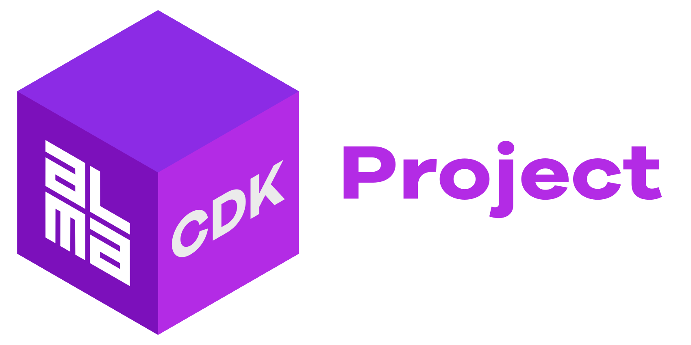

	 
	 
	
  <h1>
  <code>@alma-cdk/project</code>
   
   
  </h1>
  

   

  Opinionated CDK Project “Framework” is a set of CDK constructs and utilities aiming to solve many complexities related to configuration, naming, tagging, etc. for multi-account & multi-environment projects that utilize [Continuous Delivery & Deployment](https://continuousdelivery.com/) and [Trunk Based Development](https://trunkbaseddevelopment.com/) with feature branches/environments.

  > Things can get quite complex if you:
  > - **Deploy a CDK project into multiple different AWS Accounts**  following best practises and separating production from other environments
  > - **Manage all the account specific configurations somewhere** but it's often hard to decide where to store that information and how to access it
  > - **Need to map different environments to specific accounts** as often you may have more application environments than you have AWS accounts
  > - **Adjust your infrastructure code for specific environments** for example cost optimization or backups often behave differently for production vs. development
  > - **Potentially use dynamic & short-lived “feature environments”** e.g. by triggering temporary deployments on Github Pull Requests with a `feature/` branch prefix
  > - **Need to setup well-defined tagging** as proper tagging helps with cost management and even defining backups
  > - **Repeat the above steps for multiple CDK projects** because let's say you develop a lot of microservices in different repositories
  >
  > &nbsp;&nbsp;&nbsp;&nbsp;– Ari Palo, Lead Technologist, Alma Media

  

  

   

