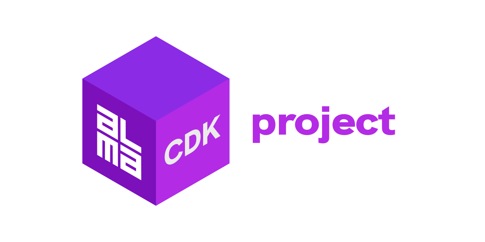
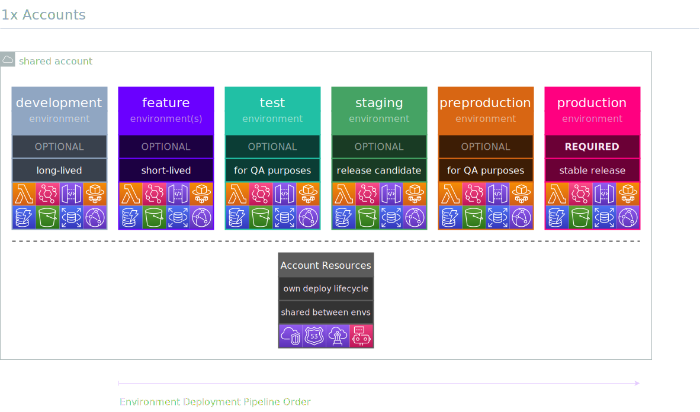
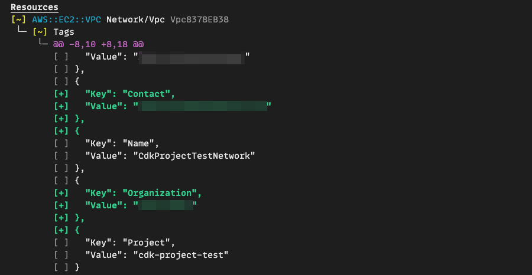
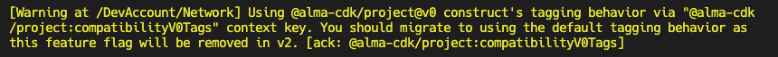
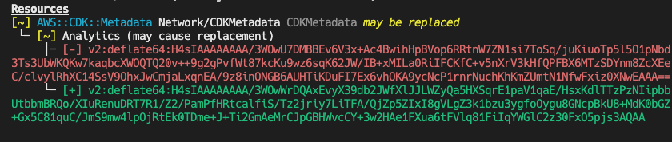

<div align="center">
  <h1>
	
  <br/>
  <br/>
  </h1>

  
  [](https://github.com/alma-cdk/project/actions/workflows/release.yml)
  [](https://sonarcloud.io/summary/new_code?id=alma-cdk_project)
  [](https://sonarcloud.io/summary/new_code?id=alma-cdk_project)
  <hr/>
</div>

> [!Tip]
> Migrating from `v0` to `v1`? See [Migration Guide](#migration-guide).

<br/>

Opinionated CDK “framework” with constructs & utilities for:
- deploying multiple environments to multiple accounts (with many-to-many relationship)
- managing account configuration through standardized props (no more random config files)
- querying account and/or environment specific information within your CDK code
- enabling dynamic & short-lived “feature-environments”
- enabling well-defined tagging
- providing structure & common conventions to CDK projects
- choosing the target account & environment by passing in runtime context:

  ```sh
  npx cdk deploy -c account=dev -c environment=feature/abc-123
  ```
  ... which means you don't need to define all the possible environments ahead of time!


## Account Strategies

Depending on the use case, you may choose a configuration between 1-3 AWS accounts with the following environments:


1. **Shared account (`shared`)**:

    
    <br/>

2. **Multi-account (`dev`+`prod`)**_– RECOMMENDED_:

    
    <br/>

<br/>
</details>

3. **Multi-account (`dev`+`preprod`+`prod`)**:

    
    <br/>

<br/>

## Getting Started

Steps required to define a _environmental_ project resources; At first, it might seem complex but once you get into the habbit of defining your projects this way it starts to make sense:

1. Choose your [Account Strategy](#account-strategies)

2. Initialize a new `Project` instead of `cdk.App`:

    ```ts
    // bin/app.ts
    import { Project, AccountStrategy } from '@alma-cdk/project';

    const project = new Project({
      // Basic info, you could also read these from package.json if you want
      name: 'my-cool-project',
      author: {
        organization: 'Acme Corp',
        name: 'Mad Scientists',
        email: 'mad.scientists@acme.example.com',
      },

      // If not set, defaults to one of: $CDK_DEFAULT_REGION, $AWS_REGION or us-east-1
      defaultRegion: 'eu-west-1',

      // Configures the project to use 2 AWS accounts (recommended)
      accounts: AccountStrategy.two({
        dev: {
          id: '111111111111',
          config: {
            // whatever you want here as [string]: any
            baseDomain: 'example.net',
          },
        },
        prod: {
          id: '222222222222',
          config: {
            // whatever you want here as [string]: any
            baseDomain: 'example.com',
          },
        },
      }),
    })
    ```

3. Define a stack which `extends SmartStack` with resources:
    ```ts
    // lib/my-stack.ts
    import { Construct } from 'constructs';
    import { StackProps, RemovalPolicy } from 'aws-cdk-lib';
    import { SmartStack, Name, UrlName, PathName, EC } from '@alma-cdk/project';

    export class MyStack extends SmartStack {
      constructor(scope: Construct, id: string, props: StackProps) {
        super(scope, id, props);

        new dynamodb.Table(this, 'Table', {
          removalPolicy: EC.isStable(this) ? RemovalPolicy.RETAIN : RemovalPolicy.DESTROY,

          tableName: Name.it(this, 'MyTable'),
          partitionKey: {
            type: dynamodb.AttributeType.STRING,
            name: 'pk',
          },
          // StagingMyTable
        });

        new events.EventBus(this, 'EventBus', {
          eventBusName: Name.withProject(this, 'MyEventBus'),
          // MyCoolProjectStagingMyEventBus
        });

        new s3.Bucket(this, 'Bucket', {

          removalPolicy: EC.isStable(this) ? RemovalPolicy.RETAIN : RemovalPolicy.DESTROY,
          autoDeleteObjects: EC.isStable(this) ? false : true,

          bucketName: UrlName.globally(this, 'MyBucket'),
          // acme-corp-my-cool-project-feature-foo-bar-my-bucket
        });

        new ssm.StringParameter(this, 'Parameter', {
          stringValue: 'Foo',
          tier: ssm.ParameterTier.ADVANCED,
          parameterName: PathName.withProject(this, 'MyNamespace/MyParameter'),
          // /MyCoolProject/Staging/MyNamespace/MyParameter
        });
      }
    }
    ```

4. Define a new _environmental_ which `extends EnvironmentWrapper` and initialize all your environmental `SmartStack` stacks within:

    ```ts
    // lib/environment.ts
    import { Construct } from 'constructs';
    import { EnvironmentWrapper } from '@alma-cdk/project';
    import { MyStack } from './my-stack';

    export class Environment extends EnvironmentWrapper {
      constructor(scope: Construct) {
        super(scope);
        new MyStack(this, 'MyStack', { description: 'This is required' });
      }
    }
    ```

    Resulting Stack properties (given `environment=staging`):

    |        Property         |                    Example value                     |
    | :---------------------- | :--------------------------------------------------- |
    | `stackName`             | `"MyCoolProject-Environment-Staging-MyExampleStack"` |
    | `terminationProtection` | `true`                                               |
    | `env.account`           | `"111111111111"`                                     |
    | `env.region`            | `"eu-west-1"`                                        |

    Resulting Tags for the Stack and its resources (given `environment=staging`):

    |        Property         |           Example value           |
    | :---------------------- | :-------------------------------- |
    | `Account`               | `dev`                             |
    | `Environment`           | `staging`                         |
    | `Project`               | `my-cool-project`                 |
    | `Author`                | `Mad Scientists`                  |
    | `Organization`          | `Acme Corp`                       |
    | `Contact`               | `mad.scientists@acme.example.com` |

5. Finally initialize the environment with the `Project` scope:

    ```ts
    // bin/app.ts
    import { Project, Accounts } from '@alma-cdk/project';
    import { Environment } from '../lib/environment';

    const project = new Project({/* removed for brevity, see step 1 */})

    new Environment(project);
    ```

<br/>


## Documentation

See detailed documentation for specific classes & methods at [constructs.dev](http://constructs.dev/packages/@alma-cdk/project).

Generally speaking you would be most interested in the following:
- Project
- AccountStrategy
- SmartStack
- AccountWrapper & EnvironmentWrapper
- AccountContext (AC)
- EnvironmentContext (EC)
- Name / UrlName / PathName

<br/>

## Migration Guide

To upgrade to stable major version 1, run:
```sh
npm i -D @alma-cdk/project@1
```

No other source code changes are required and no CloudFormation diff will be caused by this upgrade, with the exception of how you want to control the tagging behavior (see below):

### v0 to v1 Tagging behavior changes

Due to a bug in `v0`, the `Contact` and `Organization` tags were NOT applied as they were intended; This bug was fixed in `v1` which means that by default, upgrading from v0→v1 introduces CloudFormation diff:


Adding the `Contact` and `Organization` tags to all resources should be safe operation ([as we exclude problematic resources](https://github.com/alma-cdk/project/blob/main/src/smartstack/tags/exclude.ts)), but we allow disabling the "new" tagging behavior via a feature flag (since `v1.0.1`) in `cdk.json` context:

```diff
{
  "context": {
+   "@alma-cdk/project:compatibilityV0Tags": true,
    // existing context keys
  },
}
```

> [!Important]
> Using this feature flag is meant for easing the transition from v0 to v1 initially. You should still remove the feature flag at some point, as the **feature flag will be removed in future v2 major version** and the "new" tagging behavior will become default.

#### Acknowledging the warning

Using this feature flag will output warnings during synthesis:



You can safely ignore these warnings until you decide to migrate into the "new" tagging behavior, but if you want to get rid of the warning message (or you run AWS CDK CLI with `--strict` flag that fails synthesis on warnings), you can acknowledge this warning (since `v1.0.1`) by setting:
```ts
project.acknowledgeWarnings([
  {
    id: "@alma-cdk/project:compatibilityV0Tags",
    message: "Temporarily disable warnings about compatibility feature flag",
  }
]);
```

##### Strict Mode

If you are running AWS CDK CLI with `--strict` flag, the acknowledged warning will cause metadata diff:



<br/>

## Roadmap

We are drafting a vision/roadmap for upcoming v2 and v3 versions during Dec 2024 – Jan 2025. For now, see [issue #36](https://github.com/alma-cdk/project/issues/36).
